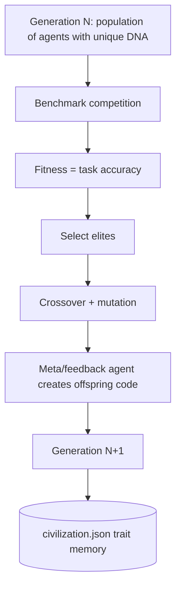

# Darwinian AI Civilization: Population-Based Self-Improvement for SIA

Standard SIA improves **one agent lineage** sequentially. We replace that with **population-based evolution**: compete on benchmark fitness → select elites → crossover + mutation → civilization memory. This changes **how self-improvement chooses the next experiment**, not just benchmark score.

---

## Tracks addressed

### Track 1 — Improve the Harness

- `--dry-run` — mock fitness evaluation ($0 API cost for evolution mechanics testing)
- `--eval_subset N` — evaluate on first N benchmark cases (time/API budget control)
- `--resume` — continue interrupted darwinian runs from last completed generation
- `--baseline_seed` — seed gen 1 from a proven `target_agent.py` (default: `runs/run_201`)
- Windows venv path fix (`Scripts/python.exe` on win32)
- Automatic `.env` loading for API keys

### Track 3 — Novel Self-Improvement

- `--darwinian` mode with population-based evolution loop
- Agent DNA traits (planning style, reflection, tool strategy, retry policy, memory, confidence, prompt structure)
- Selection (elite survival), crossover, and mutation operators
- `civilization.json` — persistent trait memory and per-generation fitness history

---

## Architecture



---

## Reproduce (Windows 11, PowerShell)

```powershell
cd c:\Users\MSPSA\Documents\SIA
.\.venv\Scripts\Activate.ps1
# Keys loaded from .env automatically (NEBIUS_API_KEY, ANTHROPIC_API_KEY)

# Verify environment
python scripts/phase0_verify.py

# Dry-run evolution ($0)
sia run --task gpqa --darwinian --population_size 2 --elite_count 1 `
  --max_gen 2 --run_id 100 --dry-run --eval_subset 5 --no-web --seed 42

# Baseline real API (submission run_1 equivalent)
sia run --task gpqa --max_gen 1 --run_id 201 --eval_subset 30 --no-web --seed 42 `
  --meta-agent-profile default-meta --target-agent-profile kimi-nebius-target

# Darwinian showcase — 2 generations, non-zero fitness (submission run_2)
sia run --task gpqa --darwinian --baseline_seed --population_size 2 --elite_count 1 `
  --max_gen 2 --run_id 311 --eval_subset 15 --no-web --seed 42 `
  --meta-agent-profile default-meta --target-agent-profile kimi-nebius-target

# Compare runs
python scripts/compare_runs.py --baseline runs/run_201 --darwinian runs/run_311 --out comparison.md
```

### Windows notes

- Use **`default-meta`** (Claude via Anthropic) for meta/feedback — **not** `kimi-nebius-meta` (OpenHands fails on Windows with `NotImplementedError`)
- Target agent inference via **`kimi-nebius-target`** (Nebius Token Factory) for GPQA dev runs
- UTF-8 subprocess fix: target agents inherit `PYTHONIOENCODING=utf-8` and `PYTHONUTF8=1` from orchestrator
- If meta agent hits turn limit (20), optionally: `$env:SIA_MAX_TURNS = "30"` before running

---

## Existing results

| Run ID | Mode | Task | Settings | Result | Submission role |
|--------|------|------|----------|--------|-----------------|
| `run_100` | darwinian dry-run | gpqa | pop=2, gen=2, subset=5 | fitness 0.4 (mock) | Harness + evolution mechanics demo |
| `run_201` | baseline | gpqa | 1 gen, subset=30 | **13.3% accuracy** (4/30) | **run_1 (baseline)** |
| `run_202` | darwinian real API | gpqa | pop=2, gen=2, subset=30 | 0% all agents | End-to-end loop (honest failure — meta turn limit + Unicode) |
| `run_300` | darwinian showcase | gpqa | pop=2, gen=1, subset=10 | 0% — Kimi empty responses | Early attempt |
| `run_311` | darwinian + baseline seed | gpqa | pop=2, gen=2, subset=15 | **gen 1: 20%, gen 2: 20% best** | **run_2 (darwinian)** — use in video |

Run ID mapping for hackathon form:

| Form label | Path | Description |
|------------|------|-------------|
| run_1 (baseline) | `runs/run_201` | Standard SIA, GPQA subset 30, 13.3% |
| run_2 (darwinian) | `runs/run_311` | 2-gen evolution, 20% vs 13.3% baseline |
| Harness demo | `runs/run_100` | Dry-run `civilization.json` |

Generate comparison table:

```powershell
python scripts/compare_runs.py --baseline runs/run_201 --darwinian runs/run_311 --out comparison.md
```

---

## Subset disclaimer

All evaluation runs used **`--eval_subset`** due to hackathon time and API budget constraints. The contribution is the **methodology** (population competition + DNA traits + civilization memory), not absolute LawBench score. Full 913-case LawBench darwinian runs are estimated at 12+ hours and were intentionally deferred.

---

## Demo video script (~90–120 seconds)

Record manually; suggested segments:

| Segment | Duration | Show |
|---------|----------|------|
| Problem | 10s | "SIA = one agent lineage improving sequentially" |
| Solution | 15s | `sia run --help` → darwinian flags; folder tree `gen_1/agent_0/` |
| Harness (Track 1) | 15s | `--dry-run`, `--eval_subset`, `--resume` |
| Evolution (Track 3) | 30s | Open `civilization.json`: generations, elites, `trait_insights` |
| Results | 20s | `python scripts/compare_runs.py` output or `comparison.md` |
| Close | 10s | "Population competition replaces implicit what-to-improve-next" |

---

## Judge pitch (one sentence)

> Standard SIA improves one agent lineage sequentially; we replace that with population-based evolution where benchmark fitness drives selection, crossover, and mutation — changing **how** self-improvement chooses the next experiment.
