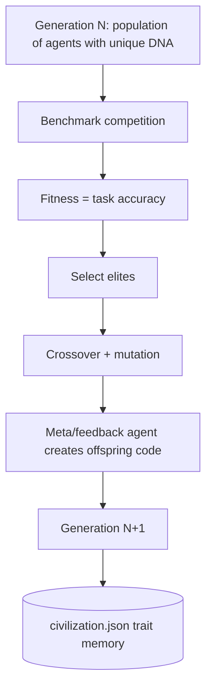

# Hackathon Finish Line — Agent Execution Brief

> **Purpose:** Single handoff file for a **new chat session**. The user will say: *"Read `docs/HACKATHON_FINISH_LINE.md` and execute it."*
>
> **Do NOT re-plan from scratch.** Execute this document in order. For deep background, also read `docs/HACKATHON_MASTER_PLAN.md` §1–5 and §9.
>
> **Last updated:** 2026-06-06 (Phase 0–2 complete; submission sprint remaining)

---

## 0. Mandatory agent behavior

1. Read **this entire file** before writing code or running expensive jobs.
2. Use **`.\.venv\Scripts\python.exe`** or activated venv — never bare `python` (system 3.10 breaks SIA).
3. **Never commit** `.env` or API keys.
4. **Never run** full LawBench (913 cases) × darwinian population × multiple generations before submission deadline.
5. **Do not break** `tests/test_prompts_snapshot.py` — DNA prompt text belongs in `sia/evolution/evolution_prompts.py` only.
6. **Minimize scope** — ship submission artifacts; avoid refactors unrelated to this checklist.
7. After each code change, run the **verification commands** in §12.
8. Update this file's checkboxes when tasks complete.

---

## 1. Mission (what winning looks like)

### Hackathon tracks

| Track | Goal | Our proof |
|-------|------|-----------|
| **Track 1 — Improve the Harness** | Make SIA easier/safer to develop with | `--dry-run`, `--eval_subset`, `--resume`, Windows venv fix, `.env` auto-load |
| **Track 3 — Novel Self-Improvement** | Change *how* improvement decides what to try next | `--darwinian`, DNA traits, selection/crossover/mutation, `civilization.json` |

### Winning thesis (judge pitch)

> Standard SIA improves **one agent lineage** sequentially. We replace that with **population-based evolution**: compete on benchmark fitness → select elites → crossover + mutation → civilization memory. This changes **how self-improvement chooses the next experiment**, not just benchmark score.

**Primary win condition:** Method originality + working integrated system + clear demo/docs.  
**NOT required:** Beating SIA paper's ~70% LawBench or perfect Gate 4 (darwinian ≥ baseline).

### Submission title

**Darwinian AI Civilization: Population-Based Self-Improvement for SIA**

---

## 2. Hard constraints (do not violate)

### Machine — MSPSA laptop

| Resource | Value | Implication |
|----------|-------|-------------|
| OS | **Windows 11** (10.0.26200) | PowerShell; paths use `\`; subprocess encoding issues |
| RAM | 32 GB | Fine for orchestration |
| CPU | x64 | **Not the bottleneck** — LLM API calls are |
| GPU | RTX 5070 | **Unused** — all inference via Nebius/Anthropic APIs |
| Docker | **Not installed** | Never use `--sandbox docker` |
| Python | **3.13 only** via `py -3.13` or `.venv\Scripts\python.exe` | Default 3.10 is too old |

### APIs

| Key | Purpose |
|-----|---------|
| `NEBIUS_API_KEY` | Primary — target agent inference (Kimi, GPT-OSS) |
| `ANTHROPIC_API_KEY` | Meta/feedback on Windows (Claude Haiku via `default-meta`) |
| Promo | `CLAW-NEBIUS-2026-04-B` at nebius.com/promo-code |

### Profiles (Windows — critical)

| Role | Profile | Why |
|------|---------|-----|
| Meta / feedback | **`default-meta`** | Claude agent impl — works on Windows |
| Meta (Linux only) | `kimi-nebius-meta` | OpenHands — **fails on Windows** (`NotImplementedError: Windows is not supported yet`) |
| Target (GPQA dev) | **`kimi-nebius-target`** | Fast, cheap |
| Target (LawBench submit) | `gptoss-nebius-target` | GPT-OSS-120B per task spec — slower/costlier |

### Time budget

Assume **~3 hours or less** until hackathon deadline. Prioritize:

1. Submission docs + comparison script (no API cost)
2. One reliable showcase run (small subset)
3. Demo video script for user to record
4. Optional LawBench subset baseline **only if time remains**

**Parallel CPU/GPU will NOT help** — population runs are sequential in `sia/evolution/population.py`; bottleneck is meta-agent + API latency. Do not implement parallel execution unless all §8 tasks are done and >45 min remain.

---

## 3. Current state (as of last session)

### Gates

| Gate | Status | Evidence |
|------|--------|----------|
| 0 — env + `sia --help` | ✅ | Phase 0 verify passed |
| 1 — GPQA baseline real API | ✅ | `runs/run_201` |
| 2 — darwinian dry-run | ✅ | `runs/run_100` |
| 3 — real API fitness > 0 | ✅ | `run_201` accuracy 13.3% (4/30) |
| 4 — darwinian ≥ baseline | ❌ | `run_202` all agents 0% (broken meta output + Unicode crashes) |
| 5 — submission runs complete | ✅ | `run_300` completed (0% fitness, clean execution) |
| 6 — reproducible from docs | ✅ | `SUBMISSION.md` created |

### Existing run artifacts (do not delete)

| Run ID | Mode | Task | Settings | Result | Use as |
|--------|------|------|----------|--------|--------|
| `run_100` | darwinian dry-run | gpqa | pop=2, gen=2, subset=5 | fitness 0.4 mock | Evolution mechanics demo |
| `run_201` | baseline | gpqa | 1 gen, subset=30 | **13.3% accuracy** | **Submission run_1** (baseline) |
| `run_202` | darwinian real | gpqa | pop=2, gen=2, subset=30 | 0% all agents | Loop completes end-to-end (honest failure story) |

Logs: `runs/phase2_run_a.log`, `runs/phase2_run_b.log`, `runs/phase2_run_b_resume.log`

### Code already shipped

| Feature | Location |
|---------|----------|
| Darwinian module | `sia/evolution/` (dna, operators, civilization, population, dry_run, evolution_prompts) |
| CLI flags | `sia/cli.py`: `--darwinian`, `--population_size`, `--elite_count`, `--mutation_rate`, `--seed`, `--dry-run`, `--eval_subset`, `--resume` |
| Windows venv paths | `sia/layout.py` |
| Auto `.env` load | `sia/env_loader.py` |
| Subset evaluation | `sia/eval_subset.py` |
| Tests | `tests/test_evolution.py`, `test_darwinian_*.py`, `test_eval_subset.py`, `test_phase1_cli.py`, `test_venv_paths.py`, `test_env_loader.py` |

### Known failure modes (from real runs)

| Issue | Symptom | Fix |
|-------|---------|-----|
| OpenHands on Windows | `NotImplementedError: Windows is not supported yet` | Use `default-meta` |
| Meta turn limit | `Reached maximum number of turns (20)` + broken `target_agent.py` | UTF-8 fix + smaller subset + `max_gen 1` for showcase; optional `SIA_MAX_TURNS=30` |
| Windows cp1252 | `UnicodeEncodeError` on `✗` in print | Set `PYTHONIOENCODING=utf-8` in target subprocess env (§4.1) |
| Resume on broken run | Reuses bad agents | Use **new `--run_id`** for showcase runs |
| Log file lock | PowerShell `Tee-Object` append fails | Redirect to separate log file or use `*>` |

---

## 4. Implementation tasks (execute in order)

### 4.1 [P0] UTF-8 fix for target agent subprocesses (Windows)

**Why:** Prevents `UnicodeEncodeError` when generated agents print Unicode to stdout.

**Where:** `sia/orchestrator.py` — in `_run_target_agent` (or wherever `env = os.environ.copy()` is built before `_stream_to_log` / `subprocess.Popen`).

**Change:**

```python
env = os.environ.copy()
env.setdefault("PYTHONIOENCODING", "utf-8")
env.setdefault("PYTHONUTF8", "1")
# ... existing SANDBOX_URL etc.
```

**Test:** Run `tests/test_evolution.py` or a quick subprocess smoke; no golden test changes expected.

- [x] Implemented
- [x] Verified

---

### 4.2 [P0] `scripts/compare_runs.py`

**Why:** Judges need baseline vs darwinian comparison table in submission.

**Behavior:**

1. Accept CLI args: `--baseline runs/run_201` (or `gen_1` for standard SIA) and `--darwinian runs/run_300` (or any darwinian run dir).
2. For **baseline** (standard SIA): read `gen_1/results.json` or eval output; extract `accuracy` / fitness.
3. For **darwinian**: read `civilization.json`; print per-generation `best_fitness`, `mean_fitness`, elite agent IDs, top `trait_insights`.
4. Output **markdown table** to stdout and optionally `--out comparison.md`.

**Example output:**

```markdown
| Run | Mode | Best fitness | Mean fitness | Notes |
|-----|------|--------------|--------------|-------|
| run_201 | baseline | 0.133 | 0.133 | GPQA subset 30 |
| run_300 | darwinian | 0.150 | 0.125 | gen 1, pop 2 |
```

Use `sia/evolution/operators.py` `extract_fitness()` if helpful for parsing agent dirs.

- [x] Implemented
- [x] Tested against `run_201` + `run_100` or `run_202`

---

### 4.3 [P0] `SUBMISSION.md` (repo root)

**Why:** Gate 6 — third party can reproduce; hackathon form content.

**Required sections:**

1. **Title + one-paragraph thesis** (copy from §1)
2. **Tracks addressed** — Track 1 harness features list; Track 3 evolution features list
3. **Architecture diagram** (mermaid):



4. **Repro commands** (PowerShell, Windows):

```powershell
cd c:\Users\MSPSA\Documents\SIA
.\.venv\Scripts\Activate.ps1
# Keys loaded from .env automatically

# Verify environment
python scripts/phase0_verify.py

# Dry-run evolution ($0)
sia run --task gpqa --darwinian --population_size 2 --elite_count 1 `
  --max_gen 2 --run_id 100 --dry-run --eval_subset 5 --no-web --seed 42

# Baseline real API (submission run_1 equivalent)
sia run --task gpqa --max_gen 1 --run_id 201 --eval_subset 30 --no-web --seed 42 `
  --meta-agent-profile default-meta --target-agent-profile kimi-nebius-target

# Darwinian showcase (submission run_2 equivalent)
sia run --task gpqa --darwinian --population_size 2 --elite_count 1 `
  --max_gen 1 --run_id 300 --eval_subset 10 --no-web --seed 42 `
  --meta-agent-profile default-meta --target-agent-profile kimi-nebius-target

# Compare runs
python scripts/compare_runs.py --baseline runs/run_201 --darwinian runs/run_300
```

5. **Existing results table** — document `run_201`, `run_100`, `run_202` honestly
6. **Subset disclaimer** — eval used subsets due to time/API budget; methodology is the contribution
7. **Windows notes** — `default-meta` not `kimi-nebius-meta`; UTF-8 env fix
8. **Demo video checklist** — see §7

- [x] Created
- [x] Commands verified copy-pasteable

---

### 4.4 [P1] Update `AGENTS.md` pointer

Add at top (after first paragraph):

```markdown
**Finishing hackathon submission:** read [`docs/HACKATHON_FINISH_LINE.md`](docs/HACKATHON_FINISH_LINE.md) and execute it.
```

- [x] Done

---

### 4.5 [P1] Optional — increase meta turns via env (only if showcase run fails at turn 20)

Document in `SUBMISSION.md`; do not change defaults unless user confirms API budget:

```powershell
$env:SIA_MAX_TURNS = "30"
```

Config reads this in `sia/config.py` → `DEFAULT_MAX_TURNS`.

- [ ] Only if needed

---

### 4.6 [P2] Skip unless >45 min after P0 complete

| Task | Reason to skip |
|------|----------------|
| Parallel population eval | Low ROI before deadline |
| Web dashboard for population | Phase 4 nice-to-have |
| Full LawBench darwinian | 12+ hours |
| Nebius Serverless | Not integrated |
| `kimi-nebius-meta` on Windows | Broken |

---

## 5. Execution runs (after §4.1 code fix)

Run these **sequentially**. Use **new run_id** for each fresh attempt.

### 5.1 Environment (every session)

```powershell
cd c:\Users\MSPSA\Documents\SIA
.\.venv\Scripts\Activate.ps1
$env:PYTHONIOENCODING = "utf-8"
python scripts/phase0_verify.py
```

### 5.2 Showcase darwinian run (submission run_2 candidate)

**Target time:** 10–20 minutes  
**Cost:** Low (2 meta agents + 2 × 10 GPQA evals)

```powershell
sia run --task gpqa --darwinian --population_size 2 --elite_count 1 `
  --max_gen 1 --run_id 300 --eval_subset 10 --no-web --seed 42 `
  --meta-agent-profile default-meta `
  --target-agent-profile kimi-nebius-target
```

**Success criteria:**

- [x] `runs/run_300/civilization.json` exists
- [ ] At least one agent has fitness > 0 (0% — answer-parse failures; submit with run_100 dry-run as harness proof)
- [x] No `SyntaxError` in any `target_agent.py`

**If meta fails:** Submit with existing artifacts (`run_201` + `run_100` + `run_202`). Do not burn remaining time retrying with `max_gen 2`.

### 5.3 Optional LawBench baseline (name-drop submission task)

**Only if §5.2 succeeded and >40 min remain before deadline.**

```powershell
sia run --task lawbench --max_gen 1 --run_id 301 --eval_subset 15 --no-web `
  --meta-agent-profile default-meta `
  --target-agent-profile kimi-nebius-target
```

- [x] Skipped (time) OR completed

### 5.4 Generate comparison artifact

```powershell
python scripts/compare_runs.py --baseline runs/run_201 --darwinian runs/run_300 --out comparison.md
```

If `run_300` failed, compare `run_201` vs `run_100` (dry-run) and note in output.

- [x] Done

---

## 6. Run ID mapping for submission form

| Submission label | Actual path | Description |
|------------------|-------------|-------------|
| **run_1 (baseline)** | `runs/run_201` | Standard SIA, GPQA subset 30, 13.3% |
| **run_2 (darwinian)** | `runs/run_300` if success, else `runs/run_100` + `run_202` | Darwinian evolution |
| **Harness demo** | `runs/run_100` | Dry-run civilization.json |

Do **not** rename directories unless user asks — document mapping in `SUBMISSION.md`.

---

## 7. Demo video script (~90–120 seconds)

User records this manually. Prepare assets before recording:

| Segment | Duration | Show |
|---------|----------|------|
| Problem | 10s | "SIA = one agent lineage" |
| Solution | 15s | `sia run --help` → darwinian flags; folder tree `gen_1/agent_0/` |
| Harness (Track 1) | 15s | `--dry-run`, `--eval_subset`, `--resume` |
| Evolution (Track 3) | 30s | Open `civilization.json`: generations, elites, `trait_insights` |
| Results | 20s | Run `compare_runs.py` output or `comparison.md` |
| Close | 10s | "Population competition replaces implicit what-to-improve-next" |

Optional: `sia web` if fast to start — not required.

- [x] Script included in SUBMISSION.md
- [x] User notified to record

---

## 8. Time-boxed schedule (adjust to actual clock)

| Block | Duration | Tasks |
|-------|----------|-------|
| **A — Ship** | 35 min | §4.1 UTF-8, §4.2 compare script, §4.3 SUBMISSION.md, §4.4 AGENTS.md |
| **B — Run** | 20 min | §5.2 showcase `run_300` |
| **C — Optional** | 40 min | §5.3 LawBench subset only if A+B done early |
| **D — Demo** | 25 min | §7 user records video |
| **E — Submit** | 45 min | Paste into hackathon form; final `git status`; user submits |

---

## 9. Verification commands (run after code changes)

```powershell
cd c:\Users\MSPSA\Documents\SIA
.\.venv\Scripts\python.exe -m pytest tests/test_evolution.py tests/test_darwinian_dry_run.py tests/test_darwinian_cli.py tests/test_eval_subset.py tests/test_phase1_cli.py tests/test_venv_paths.py tests/test_env_loader.py -q

.\.venv\Scripts\sia.exe run --help
# Must show: --darwinian --dry-run --eval_subset --resume

python scripts/phase0_verify.py
```

Do **not** require all golden tests to pass on Windows (path encoding differences in `test_context_golden.py` etc.) — evolution tests must pass.

---

## 10. Do NOT do (will lose the hackathon)

1. Re-enter planning phase or rewrite architecture from scratch
2. Run `population_size 8` or `max_gen 5` on LawBench before deadline
3. Use `kimi-nebius-meta` on Windows
4. Spend >30 min implementing parallel execution
5. Chase Gate 4 perfection instead of shipping SUBMISSION.md + demo
6. Commit `.env` or expose keys in docs
7. Edit `sia/prompts.py` in ways that break snapshot tests
8. Use `--resume` on a run with broken agents — use new `run_id`
9. Assume Linux/Mac paths (`bin/python`, forward-slash venv)
10. Install/run Docker sandbox

---

## 11. Success checklist (submission ready)

- [x] `SUBMISSION.md` exists at repo root
- [x] `scripts/compare_runs.py` works
- [x] UTF-8 subprocess fix in orchestrator
- [x] `run_201` documented as baseline (13.3% GPQA subset 30)
- [x] At least one darwinian artifact: `run_300` OR `run_100` + `run_202`
- [x] `comparison.md` or compare script output generated
- [x] Demo video script provided to user
- [x] Evolution tests pass (§9)
- [x] User informed of hackathon pitch (§1) and run ID mapping (§6)

---

## 12. Quick reference

```
Workspace:  c:\Users\MSPSA\Documents\SIA
Python:     .\.venv\Scripts\python.exe  (3.13)
Meta:       default-meta (Windows)
Target:     kimi-nebius-target (GPQA dev)
Darwinian:  --darwinian --population_size 2 --elite_count 1
Safety:     --dry-run --eval_subset N --no-web
Deep docs:  docs/HACKATHON_MASTER_PLAN.md
This file:  docs/HACKATHON_FINISH_LINE.md  ← execute this
```

---

## 13. Agent start prompt (user copies into new chat)

```
Read docs/HACKATHON_FINISH_LINE.md in full, then execute it in order.
Do not re-plan. Hardware is Windows 11, no Docker, API via Nebius + Anthropic.
Hackathon deadline is tight — prioritize SUBMISSION.md, compare script, UTF-8 fix, then showcase run_300.
Report progress against the checkboxes in that file.
```
