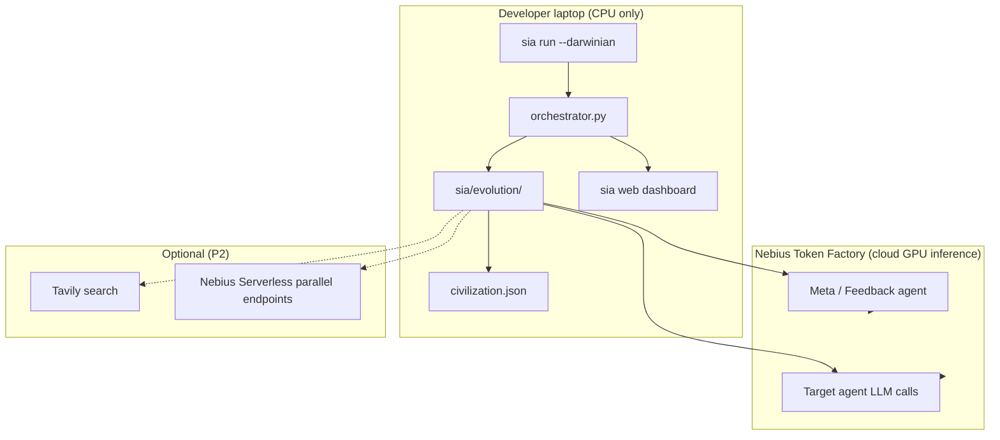
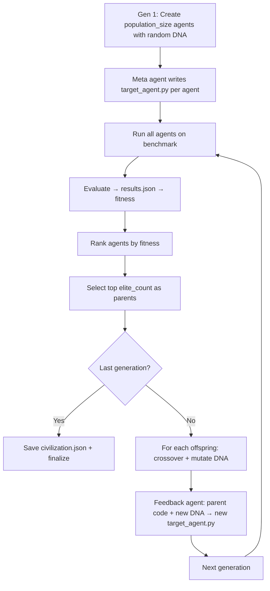

# Hackathon Master Plan: Darwinian AI Civilization for SIA

> **Purpose of this document:** Single source of truth for any agent or developer working on this project.
> Read this **before** planning or implementing. Do **not** re-run discovery from scratch unless this file is stale.
>
> **Last updated:** 2026-06-06  
> **Project:** Track 1 (Improve the Harness) + Track 3 (Novel Self-Improvement Methodology)  
> **Submission title:** *Darwinian AI Civilization: Population-Based Self-Improvement for SIA*
>
> **Active execution brief (submission sprint):** [`HACKATHON_FINISH_LINE.md`](HACKATHON_FINISH_LINE.md) — new agents should execute this file, not re-plan.

---

## Table of contents

1. [Winning thesis](#1-winning-thesis)
2. [Developer machine & environment](#2-developer-machine--environment)
3. [API & tool stack](#3-api--tool-stack)
4. [System architecture](#4-system-architecture)
5. [Codebase map & implementation status](#5-codebase-map--implementation-status)
6. [Agent DNA specification](#6-agent-dna-specification)
7. [Execution phases & gates](#7-execution-phases--gates)
8. [Run commands (copy-paste)](#8-run-commands-copy-paste)
9. [Blockers, limitations & mitigations](#9-blockers-limitations--mitigations)
10. [Cost & time budget](#10-cost--time-budget)
11. [Testing strategy](#11-testing-strategy)
12. [Submission deliverables](#12-submission-deliverables)
13. [Rules for future agents](#13-rules-for-future-agents)

---

## 1. Winning thesis

### Problem we solve

Standard SIA improves **one agent lineage** sequentially:

```
Meta Agent → Target Agent → Feedback Agent → (repeat)
```

The human/AI engineer still decides what to change, which experiments to run, and which architecture to try next. **The AI improves tasks; it does not improve AI research itself.**

### Our solution: Darwinian AI Civilization

Replace single-lineage improvement with **population-based evolution**:

```
Generation N:  agent_0 … agent_{K-1}  (each has unique DNA)
       ↓
Benchmark competition (fitness = task accuracy)
       ↓
Top elite_count survive
       ↓
Crossover + mutation → offspring DNA
       ↓
Feedback/meta agent creates next generation code
       ↓
Generation N+1
```

**Civilization memory** (`civilization.json`) tracks which DNA traits correlate with high fitness across generations.

### What judges must see

| Requirement | Proof artifact |
|-------------|----------------|
| Novel improvement loop | `--darwinian` mode + architecture diagram |
| Working demo | Completed run under `runs/run_2/` |
| Baseline comparison | `runs/run_1/` (standard) vs `runs/run_2/` (darwinian) |
| Evidence of learning | `civilization.json` trait insights |
| Reproducibility | This doc + `SUBMISSION.md` commands |

**Primary win condition:** Method originality + working system. LawBench absolute score is secondary (SIA paper already reaches ~70%).

---

## 2. Developer machine & environment

### Verified hardware (MSPSA laptop — do not assume Linux/Mac)

| Resource | Value | Implication |
|----------|-------|-------------|
| OS | Windows 11 Home (10.0.26200) | Use PowerShell; path separators are `\` |
| RAM | 32 GB | Enough for orchestration + parallel agent threads |
| CPU | x64 | SIA orchestration runs here |
| GPU | NVIDIA RTX 5070 Laptop (~12 GB VRAM) | **Not used** for harness mode — inference is via Nebius API |
| Docker | **Not installed** | Cannot use `--sandbox docker` |
| Git | 2.53 | Available |

### Python (critical)

| Item | Status |
|------|--------|
| Default `python` | 3.10.11 — **too old for SIA** |
| Available | **Python 3.13** via `py -3.13` |
| SIA requirement | `>=3.11` per `pyproject.toml` |

**Always use:**

```powershell
py -3.13 -m venv .venv
.\.venv\Scripts\Activate.ps1
pip install -e ".[claude,dev]"
```

### Known Windows bug in upstream SIA (must fix before any run)

`sia/layout.py` hardcodes Unix venv paths:

```python
# BROKEN on Windows:
os.path.join(venv_dir, "bin", "python")
# MUST be on win32:
os.path.join(venv_dir, "Scripts", "python.exe")
```

**Status:** ❌ Not fixed yet — **P0 blocker** for local execution.

### Workspace

| Path | Description |
|------|-------------|
| `c:\Users\MSPSA\Documents\SIA` | Project root (fork of hexo-ai/sia + darwinian extension) |
| `runs/` | Runtime artifacts (gitignored) |
| `sia/evolution/` | Darwinian module (our addition) |

---

## 3. API & tool stack

### Architecture principle (from Nebius webinar)

> **Orchestration on cheap CPU (laptop). Expensive GPU inference via Token Factory API.**

Do **not** attempt to self-host 120B models locally. Do **not** rely on the RTX 5070 for this project.

### Mandatory APIs

#### Nebius Token Factory (primary — all LLM calls)

| Field | Value |
|-------|-------|
| Provider ID in SIA | `nebius` |
| Base URL (bundled) | `https://api.tokenfactory.us-central1.nebius.com/v1/` |
| Alt URL (webinar docs) | `https://api.tokenfactory.nebius.com/v1/` — verify region in dashboard |
| API type | OpenAI-compatible |
| Env var | `NEBIUS_API_KEY` |
| Docs | https://docs.tokenfactory.nebius.com |

**Promo code (activate before spending):**

```
CLAW-NEBIUS-2026-04-B
```

URL: https://nebius.com/promo-code?utm_promo_event_code=4005-2026-04-webinar-running-openclaw-on-nebius&utm_promo_activation_code=CLAW-NEBIUS-2026-04-B

#### Recommended model assignment

| Role | SIA profile | Model | Why |
|------|-------------|-------|-----|
| Meta + feedback | `kimi-nebius-meta` | `moonshotai/Kimi-K2.6` | Bundled; agentic; OpenHands impl |
| LawBench target | `gptoss-nebius-target` | `openai/gpt-oss-120b-fast` | Task spec requires GPT-OSS-120B |
| Fast dev iteration | Custom profile (TODO) | `nvidia/Nemotron-3-Super-120B` | ~127 tok/s; cheap ($0.30/1M in) |
| Coding meta (alt) | Custom profile (TODO) | `MiniMaxAI/MiniMax-M2.5` | Agentic coding; $0.30/1M in |

**Bundled Nebius profiles** (in `sia/defaults/profiles/`):

- `kimi-nebius-meta` — meta/feedback via OpenHands
- `kimi-nebius-target` — target solver
- `gptoss-nebius-target` — GPT-OSS-120B for LawBench
- `qwen-nebius-target` — Qwen 80B thinking

**Single-key setup (preferred):**

```powershell
$env:NEBIUS_API_KEY = "your-key-here"
# No ANTHROPIC_API_KEY required if meta also uses Nebius
```

#### Anthropic (optional fallback)

| Env var | Used when |
|---------|-----------|
| `ANTHROPIC_API_KEY` | `--meta-agent-profile default-meta` (Claude Haiku via SDK) |

Only use if Nebius meta fails. Default hackathon path: **Nebius only**.

### Optional APIs (P2 — not on critical path)

#### Tavily (web search for agents)

| Field | Value |
|-------|-------|
| Env var | `TAVILY_API_KEY` |
| Docs | https://docs.tavily.com |
| Tools | `tavily_search`, `tavily_extract` |
| Use case | DNA trait `tool_strategy=aggressive` agents that research strategies |
| Status | ❌ Not integrated into SIA yet |

#### Nebius Serverless (parallel agent deployment)

| Field | Value |
|-------|-------|
| Docs | https://docs.nebius.com/serverless |
| Use case | Run population agents in parallel Docker endpoints |
| Blocker | Requires Docker + deploy skill; not installed locally |
| Status | ❌ Not integrated |

#### OpenClaw / nebius-skill

| Field | Value |
|-------|-------|
| Repo | https://github.com/opencolin/nebius-skill |
| Note | **Do not rebuild on OpenClaw.** We use SIA. Same Nebius API applies. |

### Local tools

| Tool | Purpose | Status |
|------|---------|--------|
| `uv` | Faster venv/pip on Windows | Optional but recommended |
| `pytest` | Tests | Required for dev |
| `sia web` | Live dashboard | Auto-starts unless `--no-web` |

---

## 4. System architecture

### High-level diagram



### Standard SIA vs Darwinian mode

| Aspect | Standard SIA | Darwinian mode |
|--------|--------------|----------------|
| Trigger | Default | `--darwinian` |
| Agents per gen | 1 (`target_agent.py`) | N (`gen_N/agent_M/`) |
| Improvement | Feedback rewrites single agent | Selection + crossover + mutation |
| Memory | `context.md` | `context.md` + `civilization.json` |
| Meta agent | Once at start | Once per gen-0 agent + feedback per offspring |
| Fitness | `results.json` accuracy | Same, per agent |

### Darwinian run directory layout

```
runs/run_{run_id}/
├── civilization.json              # Trait history, elite IDs, fitness per gen
├── civilization_summary.md        # Markdown summary for humans
├── context.md                     # Standard SIA context log
├── profiles.json                  # Resolved profile snapshot
├── venv/                          # Shared venv for all agents in run
├── gen_1/
│   ├── agent_0/
│   │   ├── agent_dna.json         # Genotype
│   │   ├── target_agent.py        # Phenotype (generated code)
│   │   ├── submission.csv         # Task output
│   │   ├── results.json           # Fitness (accuracy)
│   │   ├── score.json             # {fitness, results}
│   │   ├── meta_agent_prompt.txt  # Gen 1 only
│   │   └── target_agent_stdout.log
│   ├── agent_1/
│   └── ...
├── gen_2/
│   ├── agent_0/                   # Offspring of gen_1 elites
│   └── ...
└── gen_N/
```

### Evolution loop (internal)



### Bundled tasks

| Task | Test size | Metric | Notes |
|------|-----------|--------|-------|
| `lawbench` | **913 cases** | accuracy | Chinese charge prediction; **primary submission task** |
| `gpqa` | 198 questions | accuracy | **Use for cheap dev iteration** |
| `longcot-chess` | varies | varies | Not primary |
| `spaceship-titanic` | varies | varies | Not primary |

LawBench task spec (`sia/tasks/lawbench/data/public/task.md`):

- Requires solver model **`openai/gpt-oss-120b`**
- Output: `submission.csv` with columns `id,label`
- Baseline context: zero-shot ~7%, strong harness ~45%, SIA paper ~70%

---

## 5. Codebase map & implementation status

### Core SIA (upstream)

| File | Role |
|------|------|
| `sia/orchestrator.py` | Main loop; branches to darwinian at `--darwinian` |
| `sia/cli.py` | CLI flags including darwinian options |
| `sia/layout.py` | Path constants; `gen_agent_dir()`, `civilization_json` |
| `sia/config.py` | Defaults: population_size=8, elite_count=2, mutation_rate=0.25 |
| `sia/prompts.py` | Meta/feedback prompts (**do not break snapshot tests**) |
| `sia/run_setup.py` | Run dir + venv creation |
| `sia/profiles.py` | JSON profile loading |
| `sia/defaults/providers/nebius.json` | Nebius provider config |

### Darwinian module (our addition)

| File | Role | Status |
|------|------|--------|
| `sia/evolution/dna.py` | `AgentDNA` dataclass, random init, save/load | ✅ Done |
| `sia/evolution/operators.py` | selection, crossover, mutation, fitness extract | ✅ Done |
| `sia/evolution/civilization.py` | `CivilizationMemory` → `civilization.json` | ✅ Done |
| `sia/evolution/evolution_prompts.py` | DNA blocks for meta/feedback prompts | ✅ Done |
| `sia/evolution/population.py` | `run_darwinian_loop()` main orchestration | ✅ Done (needs hardening) |
| `tests/test_evolution.py` | Unit tests (14 pass) | ✅ Done |
| `tests/test_darwinian_cli.py` | CLI flag tests | ✅ Done |

### P0 features NOT yet implemented

| Feature | CLI flag | Purpose | Priority | Status |
|---------|----------|---------|----------|--------|
| Windows venv fix | — | Run on developer machine | **P0** | ✅ Phase 0 |
| Auto `.env` load | — | Load keys from `.env` | **P0** | ✅ Phase 0 |
| Dry-run mode | `--dry-run` | Test evolution without API spend | **P0** | ✅ Phase 1 |
| Subset evaluation | `--eval_subset N` | Evaluate first N cases only | **P0** | ✅ Phase 1 |
| Resume/checkpoint | `--resume` | Skip agents with existing results.json | **P0** | ✅ Phase 1 |
| End-to-end smoke test | — | Prove one real API path works | **P0** | ❌ Phase 2 (Gate 3) |
| Custom MiniMax meta profile | JSON file | Cheaper meta agent | P1 |
| Parallel agent execution | — | Reduce wall-clock time | P1 |
| Web dashboard population view | — | Demo polish | P1 |
| Tavily integration | — | Research DNA agents | P2 |
| Nebius Serverless parallel | — | Cloud parallel agents | P2 |

### CLI flags (current)

```
sia run --task lawbench --darwinian \
  --population_size 8 \
  --elite_count 2 \
  --mutation_rate 0.25 \
  --seed 42 \
  --max_gen 5 \
  --run_id 2 \
  --meta-agent-profile kimi-nebius-meta \
  --target-agent-profile gptoss-nebius-target \
  --no-web
```

Note: `--run_id` is an **integer**, not a string.

---

## 6. Agent DNA specification

Each agent has a JSON genotype at `agent_dna.json`:

```json
{
  "planning_style": "stepwise",
  "reflection": true,
  "tool_strategy": "selective",
  "retry_policy": "generic",
  "memory": "short_summary",
  "confidence_threshold": 0.75,
  "prompt_structure": "detailed"
}
```

| Trait | Allowed values | Implementation meaning |
|-------|----------------|------------------------|
| `planning_style` | stepwise, direct, hierarchical | Control flow before acting |
| `reflection` | true, false | Self-critique loops |
| `tool_strategy` | aggressive, selective, minimal | Tool usage frequency |
| `retry_policy` | none, generic, error_specific | Error recovery behavior |
| `memory` | none, short_summary, failure_based, full_history | Cross-sample memory |
| `confidence_threshold` | 0.0–1.0 | Answer commitment threshold |
| `prompt_structure` | minimal, detailed, chain_of_thought | Prompt scaffolding |

**Operators:**

- **Selection:** top `elite_count` by fitness (accuracy from `results.json`)
- **Crossover:** random per-trait inheritance from two parents
- **Mutation:** each trait mutates with probability `mutation_rate`

**Fitness extraction** (`operators.extract_fitness`): reads `accuracy`, `score`, `f1`, `reward`, or `success_rate` from `results.json`; defaults to 0.0.

---

## 7. Execution phases & gates

**Never skip gates. Never run full LawBench darwinian before Gate 4.**

### Phase 0 — Environment setup (~3 hours)

- [ ] Redeem promo `CLAW-NEBIUS-2026-04-B`
- [ ] Set `$env:NEBIUS_API_KEY`
- [ ] Create Python 3.13 venv; `pip install -e ".[claude,dev]"`
- [x] Fix Windows venv paths in `sia/layout.py`
- [x] Auto-load `.env` via `sia/env_loader.py` in orchestrator
- [x] Verify `sia run --help` shows `--darwinian`
- [x] Run `scripts/phase0_verify.py` (Python, keys, Nebius API)

**Gate 0:** `sia --help` exits 0  
**Gate 1:** Single-gen GPQA baseline completes with Nebius profiles

### Phase 1 — Harden Darwinian harness (Day 1) ✅

- [x] Implement `--dry-run`, `--eval_subset`, `--resume`
- [x] Fix bugs in `population.py` (lazy imports, eval paths)
- [x] Add integration tests (`test_eval_subset`, `test_darwinian_dry_run`, `test_phase1_cli`)
- [x] Run dry-run: pop=2, gen=2, GPQA, `--eval_subset 5`
- [x] Skip LLM context summaries in dry-run (`skip_llm_summary`)

**Gate 2:** Dry-run produces valid `civilization.json` with ranked agents ✅

### Phase 2 — Real API validation (Day 1–2) 🔄

| Run | Task | Settings | Status |
|-----|------|----------|--------|
| A | gpqa | 1 agent, 1 gen, subset=30 | ✅ run_201 — accuracy **13.3%** (4/30) |
| B | gpqa | darwinian, pop=2, gen=2, subset=30 | ✅ run_202 — best fitness **0.0%** (all agents failed/broke) |
| C | lawbench | baseline, 1 gen, subset=50 | ❌ pending |
| D | lawbench | darwinian, pop=4, gen=3, subset=100 | ❌ pending |

**Windows meta profile:** use `--meta-agent-profile default-meta` (Claude Haiku), not `kimi-nebius-meta` (OpenHands requires Linux).

**Gate 3:** Real API run returns fitness > 0 ✅ (Run A: 0.133 accuracy)  
**Gate 4:** Darwinian best ≥ baseline best on **same subset** ❌ (baseline 13.3% vs darwinian 0.0% — meta turn-limit + Windows Unicode crashes)

### Phase 3 — Submission runs (Day 2–3)

| run_id | Mode | Settings |
|--------|------|----------|
| 1 | Baseline | `--task lawbench --max_gen 5` |
| 2 | Darwinian | `--darwinian --population_size 4 --elite_count 2 --max_gen 5 --seed 42` |

Full 913 cases only if promo credits allow after Gate 4.

**Gate 5:** Both runs complete with artifacts

### Phase 4 — Demo & docs (Day 3–4)

- [ ] `SUBMISSION.md` with repro commands
- [ ] Comparison table script
- [ ] 2-min demo video (`sia web` + civilization.json)
- [ ] Architecture slide

**Gate 6:** Third party can reproduce from docs alone

---

## 8. Run commands (copy-paste)

### Environment (every session)

```powershell
cd c:\Users\MSPSA\Documents\SIA
.\.venv\Scripts\Activate.ps1
$env:NEBIUS_API_KEY = "your-key-here"
```

### Development (cheap — use until Gate 4 passes)

```powershell
# Dry-run — $0 API cost (after --dry-run is implemented)
sia run --task gpqa --darwinian --population_size 2 --elite_count 1 `
  --max_gen 2 --run_id 100 --dry-run --no-web --seed 42

# Real API, small (after --eval_subset is implemented)
sia run --task lawbench --darwinian --population_size 2 --elite_count 1 `
  --max_gen 2 --run_id 101 --eval_subset 50 --no-web --seed 42 `
  --meta-agent-profile kimi-nebius-meta `
  --target-agent-profile gptoss-nebius-target
```

### Submission (after all gates pass)

```powershell
# Baseline
sia run --task lawbench --max_gen 5 --run_id 1 --no-web `
  --meta-agent-profile kimi-nebius-meta `
  --target-agent-profile gptoss-nebius-target

# Darwinian
sia run --task lawbench --max_gen 5 --run_id 2 --darwinian `
  --population_size 4 --elite_count 2 --mutation_rate 0.25 --no-web --seed 42 `
  --meta-agent-profile kimi-nebius-meta `
  --target-agent-profile gptoss-nebius-target
```

Add `--eval_subset 200` to submission commands if promo credits are insufficient; document clearly in SUBMISSION.md.

### Delete a failed run before retry

```powershell
Remove-Item -Recurse -Force runs/run_101
```

---

## 9. Blockers, limitations & mitigations

### CRITICAL — will cause total failure

| ID | Blocker | Affected | Mitigation | Status |
|----|---------|----------|------------|--------|
| B1 | Windows venv uses `bin/python` not `Scripts/python.exe` | All target agent execution | Fix `venv_python_path()` / `venv_pip_path()` | ✅ Fixed Phase 0 |
| B2 | Python 3.10 default | pip install, runtime | Always `py -3.13` | ⚠️ Manual |
| B3 | Missing `NEBIUS_API_KEY` | All LLM calls | Set env var; redeem promo | ⚠️ Manual |
| B4 | Full LawBench before loop validated | Budget exhausted | `--eval_subset`; dry-run first | ✅ Phase 1 |
| B5 | Darwinian never tested E2E with real API | Demo failure | Follow gates 0→6 | ✅ Gate 3 (Run A) |
| B8 | OpenHands V1 terminal unsupported on Windows | `kimi-nebius-meta` fails | Use `default-meta` (Claude) for meta on Windows | ⚠️ Workaround |

### HIGH — project works but degraded

| ID | Blocker | Affected | Mitigation |
|----|---------|----------|------------|
| H1 | 913 LLM calls per LawBench agent | Time (1–3 hr/agent) | subset eval; parallel agents |
| H2 | pop × gen meta/feedback calls | API cost | pop=4 not 8; Nebius cheap models |
| H3 | No Docker | `--sandbox docker` | Use `--sandbox none` |
| H4 | DNA → code coupling weak | Evolution looks cosmetic | Strong prompts; diverse gen-0 seeds |
| H5 | Sequential population runs | 12+ hour submission runs | Parallel execution (P1) |
| H6 | No resume on crash | Lost progress | `--resume` (P0) |
| H7 | OpenHands meta may need extra deps / Windows | Meta agent fails | On Windows: `default-meta` + Anthropic; Linux: `kimi-nebius-meta` |

### MEDIUM — optional impact

| ID | Blocker | Affected | Mitigation |
|----|---------|----------|------------|
| M1 | Promo credits unknown/l finite | Full submission run | Subset + methodology story |
| M2 | LawBench Chinese text | Accuracy | GPT-OSS-120B or Qwen/GLM |
| M3 | Tavily not integrated | Research DNA agents | Skip or P2 |
| M4 | Serverless not integrated | Parallel cloud runs | Local thread pool first |
| M5 | `tests/test_prompts_snapshot.py` | Prompt edits break CI | Add DNA prompts in separate file only |

### Accepted tradeoffs

| Decision | Rationale |
|----------|-----------|
| population_size = **4** (not 8) | 2× cheaper; enough diversity |
| Subset eval for dev + possibly submission | Full 913 × pop × gen is ~36k+ solver calls |
| No OpenClaw migration | SIA already has Nebius profiles |
| No weights/RL mode | Out of scope; harness only |
| GPU unused | By design — API inference |

---

## 10. Cost & time budget

### API call volume (LawBench, full eval)

| Config | Agent runs | Solver calls (913 each) | Meta+feedback sessions |
|--------|------------|-------------------------|-------------------------|
| Baseline gen=5 | 5 | ~4,565 | ~5 |
| Darwinian pop=4, gen=5 | 20 | ~18,260 | ~4 + 16 = ~20 |

### Rough cost (Nebius Token Factory)

| Scenario | Est. cost |
|----------|-----------|
| Dry-run | $0 |
| GPQA subset 30, pop=2, gen=2 | $5–20 |
| LawBench subset 100, pop=4, gen=3 | $30–100 |
| LawBench full, pop=4, gen=5 | $200–500+ |

Use promo credits for submission runs. **Always subset-first.**

### Wall-clock (sequential, no parallel)

| Step | Estimate |
|------|----------|
| One full LawBench agent | 1–3 hours |
| pop=4, gen=3 full LawBench | 12–36 hours |
| Meta/feedback per agent | 5–20 min |

---

## 11. Testing strategy

### Layer 1 — Unit tests (free, run always)

```powershell
py -3.13 -m pytest tests/test_evolution.py tests/test_darwinian_cli.py -q
```

### Layer 2 — Dry-run integration (free, after implemented)

Full darwinian loop with mock agents returning fake fitness.

### Layer 3 — Subset API smoke

Real Nebius calls; `--eval_subset 20` minimum.

### Layer 4 — Submission runs

Full or large subset; only after Gate 4.

### Do not break

- `tests/test_prompts_snapshot.py` — edit `sia/prompts.py` carefully
- `tests/test_generation_loop.py` — standard SIA loop regression

---

## 12. Submission deliverables

| Item | Path / artifact |
|------|-----------------|
| Title | Darwinian AI Civilization: Population-Based Self-Improvement for SIA |
| Code | `sia/evolution/` + orchestrator/cli changes |
| Baseline run | `runs/run_1/` |
| Darwinian run | `runs/run_2/` + `civilization.json` |
| Comparison table | best/mean fitness per generation |
| Trait analysis | `civilization.json` → `trait_insights` |
| Repro doc | `SUBMISSION.md` (create at Phase 4) |
| Demo video | `sia web` + evolution narrative |
| Master plan | This file |

---

## 13. Rules for future agents

### MUST DO

1. **Read this file first** before planning or implementing.
2. **Use Python 3.13** (`py -3.13`), not system default 3.10.
3. **Set `NEBIUS_API_KEY`** before any real run; redeem promo if not done.
4. **Fix B1 (Windows venv)** before claiming "it works on this machine."
5. **Implement/run dry-run and subset eval** before any full LawBench darwinian run.
6. **Follow gates 0→6** in order; do not skip to submission runs.
7. **Keep baseline run (`run_1`)** for comparison with darwinian (`run_2`).
8. **Use `--no-web`** during automated/headless runs to reduce overhead.
9. **Preserve** `sia/prompts.py` snapshot tests — put DNA prompt text in `sia/evolution/evolution_prompts.py` only.
10. **Document** any new CLI flags in this file when added.

### MUST NOT DO

1. **Do not run** `--darwinian --population_size 8 --max_gen 5` on full LawBench as first test.
2. **Do not assume** Linux paths (`bin/python`, forward slashes in venv).
3. **Do not assume** Docker is available.
4. **Do not migrate to OpenClaw** — extend SIA.
5. **Do not self-host** 120B models on local GPU for this project.
6. **Do not commit** API keys or `.env` files.
7. **Do not overwrite** existing run dirs — use new `--run_id` or delete explicitly.
8. **Do not chase 70%+ LawBench** as primary goal — win on methodology.
9. **Do not add Tavily/Serverless** before P0 features work.
10. **Do not re-plan from scratch** — update this file if facts change.

### When something fails

| Symptom | Likely cause | Action |
|---------|--------------|--------|
| `bin/python` not found | B1 Windows venv | Fix layout.py |
| Package requires Python >=3.11 | Wrong python | Use py -3.13 |
| NEBIUS_API_KEY warning | Missing key | Set env var |
| Run dir exists error | Previous run | Delete run dir or new run_id |
| No submission.csv | Target agent crashed | Check `target_agent_stdout.log` |
| fitness always 0 | Eval failed or subset issue | Check `evaluation.log` |
| Meta agent auth fail | Wrong profile/key | Try kimi-nebius-meta + NEBIUS_KEY |

### Updating this document

When implementation status changes (e.g. `--dry-run` shipped, Windows fix merged), update:

- Section 5 (implementation status table)
- Section 9 (blocker Status column)
- Section 13 if new rules emerge

---

## 14. Sibling repo — SIA-CABS (parallel build, merge later)

**Workspace:** `c:\Users\MSPSA\Documents\SIA2`  
**Master plan:** `SIA2/docs/HACKATHON_MASTER_PLAN.md` (Sections 18–19 = merge contracts)

| Layer | Repo | Scope |
|-------|------|-------|
| CABS (beliefs, contradictions, research questions) | **SIA2** | Do not implement here |
| Darwinian (population, DNA, civilization.json) | **SIA (this repo)** | Do not implement in SIA2 |

**Hackathon strategy:** Two independent Track 3 submissions; merge in Phase 7.

**Handoff files:**
- SIA2 → SIA: `belief_store/research_questions.json` (`dna_field` maps to mutation bias)
- SIA → SIA2: `civilization.json` `trait_insights` → CABS beliefs

**Budget:** ~40% API spend for darwinian subset runs; ~60% reserved for SIA2 GPQA CABS runs. Never run both full GPQA jobs in parallel.

---

## Quick reference card

```
PROJECT:  Darwinian AI Civilization for SIA (hexo-ai/sia fork)
MACHINE:  Windows 11, 32GB RAM, RTX 5070 (unused), NO Docker
PYTHON:   py -3.13 only
API:      NEBIUS_API_KEY (Token Factory) — primary
PROMO:    CLAW-NEBIUS-2026-04-B
TASK:     lawbench (submit), gpqa (dev)
PROFILES: kimi-nebius-meta + gptoss-nebius-target
MODE:     --darwinian --population_size 4 --elite_count 2
BLOCKER:  Windows venv path (B1) — fix first
RULE:     dry-run → subset → compare → full run
```
