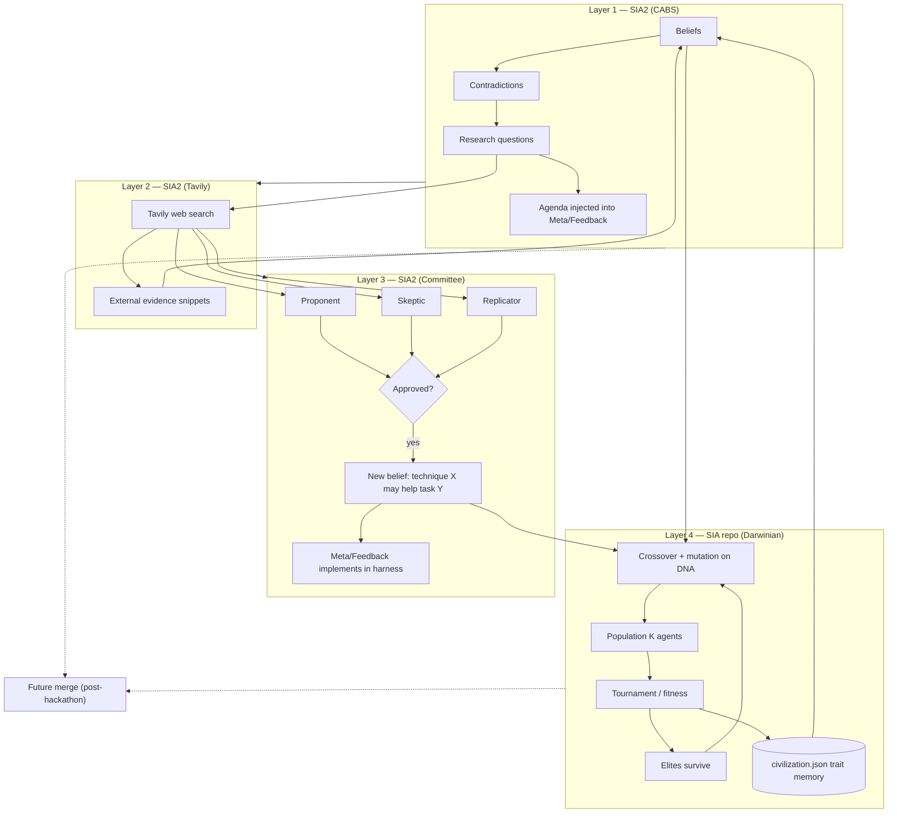
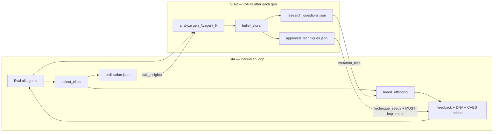

# SIA-CABS Hackathon Master Plan

> **READ THIS FIRST.** Any agent working on this repo must read this entire document before planning, coding, or running expensive commands. Do not re-plan from scratch. Implement in phase order with gates.

**Last updated:** 2026-08-08 (Section 21 ICML; Tick 56 re-link uv Cursor env draft `f5eaef73` + Portal Save target)  
**Project:** SIA-CABS (Contradiction-Aware Belief System) — **Layer 1 of unified self-improvement stack**  
**Workspace:** `c:\Users\MSPSA\Documents\SIA2`  
**Sibling repo:** Darwinian AI Civilization → `c:\Users\MSPSA\Documents\SIA` (build in parallel; merge later)  
**Primary track:** Track 3 — Novel Self-Improvement Methodology  
**Secondary track:** Track 1 — SIA harness extension  

---

## 0. Agent instructions (mandatory)

### Before you do anything

1. Read this file end-to-end.
2. Check **Section 12 (Implementation status)** — do not rebuild what exists.
3. Never start Phase 2 (paid API runs) until Phase 0 gates pass.
4. Never run LawBench full runs without explicit user approval and budget check.
5. Never use `--focus weights` (RL mode) — requires Tinker + Modal + cloud GPU.
6. Never delete `runs/` directories without user approval (they are experiment evidence).
7. Always use unique `--run_id` values; SIA refuses to overwrite existing runs.
8. Prefer `--no-web` for long runs (less overhead).
9. Monitor API spend; stop if approaching budget ceiling (Section 8).

### Winning thesis (do not drift)

Most teams optimize benchmark score. We optimize **what to investigate next** when beliefs contradict.

```
Standard SIA:  Failure → Fix → Higher score
SIA-CABS:      Belief → Contradiction → Research question → Investigation → New theory
```

Judges win on **methodology + reproducible evidence**, not necessarily highest accuracy.

---

## 1. Machine environment (developer laptop)

Verified on 2026-06-06:

| Resource | Value | Implication |
|----------|-------|-------------|
| **OS** | Windows 11 Home (Build 26200) | SIA upstream assumes Unix paths — **Windows patch required** (Section 6.1) |
| **CPU** | Intel Core Ultra 9 275HX, 24 cores / 24 threads | More than enough for orchestration |
| **RAM** | 32 GB (~32,189 MB) | Sufficient for SIA per-run venv + pandas/sklearn eval |
| **GPU** | NVIDIA GeForce RTX 5070 Ti Laptop (~4 GB VRAM reported) + Intel Graphics | **NOT used** in harness mode; inference is API-based |
| **Disk** | ~670 GB free on C: | Sufficient |
| **Python (use this)** | **3.13** via `py -3.13` | SIA requires >= 3.11 |
| **Python (avoid default)** | 3.10.11 at `Python310\python.exe` | Too old / wrong venv if used by mistake |
| **Shell** | PowerShell | Use `;` not `&&` for command chaining |
| **Venv path** | `c:\Users\MSPSA\Documents\SIA2\.venv` | Created with Python 3.13 |

### Hardware verdict

- **CPU/RAM/Disk:** No blocker for this project.
- **Local GPU:** Irrelevant for planned architecture (API inference only).
- **Do not** attempt local 120B+ model inference on laptop.

---

## 2. Repository layout

```
SIA2/
├── docs/
│   └── HACKATHON_MASTER_PLAN.md    ← THIS FILE
├── AGENTS.md                        ← Pointer for Cursor agents
├── README.md                        ← User-facing quick start
├── pyproject.toml                   ← sia-cabs package (v0.1.0)
├── .venv/                           ← Python 3.13 virtualenv (gitignored)
├── .gitignore
│
├── cabs/                            ← CABS core (belief science engine)
│   ├── belief_store.py              ← JSON persistence (beliefs, contradictions, RQs)
│   ├── belief_extractor.py          ← Heuristic extraction from gen artifacts
│   ├── contradiction_detector.py    ← Opposing beliefs on same topic
│   ├── research_question_generator.py
│   ├── experiment_planner.py
│   ├── research_agent.py            ← Rank + enrich agenda
│   ├── belief_engine.py             ← Pipeline orchestrator per generation
│   └── prompt_injection.py          ← Inject agenda into SIA prompts
│
├── sia_cabs/                        ← SIA integration layer
│   ├── orchestrator.py              ← SIA loop + CABS hooks (entry: sia-cabs)
│   └── cli.py                       ← analyze / agenda tools (sia-cabs-tools)
│
├── belief_store/                    ← Template JSON schemas (not per-run data)
│   ├── beliefs.json
│   ├── contradictions.json
│   └── research_questions.json
│
├── sia-upstream/                    ← Cloned hexo-ai/sia (editable install)
│   └── sia/                         ← Modify here for Windows venv fix
│
├── scripts/
│   └── demo_cabs.py                 ← Offline demo (no API keys)
│
├── tests/
│   └── test_cabs_pipeline.py        ← 4 unit tests (expand to 12+)
│
└── runs/                            ← Created at runtime (gitignored)
    └── run_<id>/
        ├── belief_store/            ← Per-run beliefs (CABS only)
        ├── gen_<n>/
        │   ├── target_agent.py
        │   ├── results.json
        │   ├── improvement.md
        │   └── cabs_report.json
        └── context.md
```

---

## 3. System architecture

### 3.1 Standard SIA loop (baseline)

```
Meta Agent → writes target_agent.py (gen 1)
     ↓
For each generation:
  Target Agent → executes task → logs + submission
     ↓
  evaluate.py → results.json
     ↓
  Feedback Agent → writes improved target_agent.py + improvement.md
```

### 3.2 SIA-CABS loop (our extension)

```
Meta Agent (with CABS agenda injected)
     ↓
Target Agent → evaluate
     ↓
Feedback Agent (with CABS agenda injected)
     ↓
Belief Engine:
  1. Belief Extractor      ← improvement.md, results.json, target_agent.py
  2. Contradiction Detector ← same topic, opposing polarity
  3. Research Question Generator
  4. Experiment Planner
  5. Update belief_store/
     ↓
Next generation Meta/Feedback receive active contradictions + research questions
```

### 3.3 Inference split (orchestration vs models)

```
┌─────────────────────────────────────────┐
│  LAPTOP (CPU) — Orchestration           │
│  sia-cabs, Belief Engine, evaluate.py   │
└─────────────────────────────────────────┘
         │                    │
         ▼                    ▼
  Anthropic API         Nebius Token Factory
  Meta + Feedback       Target Agent inference
  Claude Haiku          Nemotron / Qwen / Kimi
  (cheap, Claude SDK)   (fast, pay-per-token, no local GPU)
```

**Layers 2–4** (later phases; see Section 18): Tavily grounding, committee gating, Darwinian population (sibling repo).

**Explicitly NOT in this repo (build elsewhere or later):**
- OpenClaw (separate framework; SIA already orchestrates)
- Weights/RL mode (`--focus weights`)
- Local GPU inference
- Darwinian population loop → **`c:\Users\MSPSA\Documents\SIA`** (do not implement here unless user asks)
- Committee + Tavily → Phase 5–6 here, after hackathon submission if time allows

### 3.4 Unified vision (four layers + merge)

Long-term goal: a **stacked self-improvement civilization** — not one trick, but complementary loops.



| Layer | Repo | What it optimizes | Hackathon priority |
|-------|------|-------------------|-------------------|
| **1 — CABS** | `SIA2` | *What to investigate* when beliefs contradict | **P0 — submit this** |
| **2 — Tavily** | `SIA2` | Ground research questions in external evidence | P2 — after GPQA runs |
| **3 — Committee** | `SIA2` | Gate external techniques before implementation | P3 — stretch |
| **4 — Darwinian** | `SIA` | *Which agent architecture* wins via population competition | **P0 parallel** — separate submission story |
| **Merge** | unified fork | CABS beliefs about DNA traits; contradictions across population; committee seeds mutations | Post-deadline |

**Two winning narratives (can submit separately or combined later):**

1. **CABS (SIA2):** Science-style self-improvement — belief → contradiction → investigation.
2. **Darwinian (SIA):** Evolution-style self-improvement — population → selection → crossover/mutation → civilization memory.

Combined pitch (merge): *"An AI civilization that both evolves architectures and questions its own assumptions."*

### 3.5 Split-repo work plan (who builds what)

| Work item | Owner repo | Path | Do not duplicate in |
|-----------|------------|------|---------------------|
| Belief store, contradiction detector, RQ generator | **SIA2** | `cabs/` | SIA |
| `sia-cabs` orchestrator + prompt injection | **SIA2** | `sia_cabs/` | SIA |
| DNA schema, crossover, mutation, tournament | **SIA** | `sia/evolution/` | SIA2 |
| `--darwinian`, `--population_size`, `civilization.json` | **SIA** | `sia/cli.py`, `sia/orchestrator.py` | SIA2 |
| Windows venv fix, `.env`, Nebius profiles | **Both** (each has own `sia-upstream` or fork) | — | — |
| Tavily research agent | **SIA2** | `cabs/research_agent.py` (extend) | SIA |
| Committee (proponent/skeptic/replicator) | **SIA2** | `cabs/committee/` (new, Phase 6) | SIA |
| Unified orchestrator | **Future** | `sia-unified` or merge into one repo | — |

**Coordination rule:** Each repo maintains its own `docs/HACKATHON_MASTER_PLAN.md`. This file is authoritative for **CABS + Layers 2–3**. Darwinian phases live in `SIA/docs/HACKATHON_MASTER_PLAN.md`. Cross-repo contracts: Section 19.

### 3.6 Parallel timeline (two developers / two agents)

```
Week 1 (hackathon)
├── SIA2: Phase 0 ✅ → Phase 1 → Phase 2 (GPQA CABS) → Phase 3 (submission)
└── SIA:  Phase 0–1 ✅ → Phase 2 (GPQA darwinian subset) → submission

Week 2+ (if time)
├── SIA2: Phase 5 (Tavily) → Phase 6 (committee)
└── SIA:  Lawbench showcase, larger population

Post-hackathon
└── Phase 7: merge — CABS reads civilization.json; Darwinian reads belief_store/
```

**Budget split (shared $100–200 Nebius + Anthropic):**
- Reserve ~60% for SIA2 GPQA baseline + CABS (primary Track 3 evidence).
- Reserve ~40% for SIA darwinian subset runs (population × subset cases).
- Never run both repos' full GPQA jobs in parallel.

---

## 4. APIs, keys, and external services

### 4.1 Required keys

| Env variable | Service | Used for | How to obtain |
|--------------|---------|----------|---------------|
| `ANTHROPIC_API_KEY` | Anthropic | Meta Agent + Feedback Agent (Claude SDK) | https://console.anthropic.com |
| `NEBIUS_API_KEY` | Nebius Token Factory | Target Agent inference (OSS models) | Nebius console; promo code below |

**Set in PowerShell (session):**
```powershell
$env:ANTHROPIC_API_KEY = "sk-ant-..."
$env:NEBIUS_API_KEY = "..."
```

**Never commit keys.** Never log keys. Never put keys in markdown files.

### 4.2 Nebius promo / credits

- Promo event: Nebius + OpenClaw webinar
- Activation code: `CLAW-NEBIUS-2026-04-B`
- URL: https://nebius.com/promo-code?utm_promo_event_code=4005-2026-04-webinar-running-openclaw-on-nebius&utm_promo_activation_code=CLAW-NEBIUS-2026-04-B
- Token Factory docs: https://docs.tokenfactory.nebius.com
- SIA bundled provider: `sia/defaults/providers/nebius.json`
- Base URL: `https://api.tokenfactory.us-central1.nebius.com/v1/`

### 4.3 Optional keys (Phase 4 only)

| Env variable | Service | Used for | Cost note |
|--------------|---------|----------|-----------|
| `TAVILY_API_KEY` | Tavily | Research Agent web search | Free tier limited; use sparingly |
| `TINKER_API_KEY` | Tinker | **DO NOT USE** unless weights mode | Required for lawbench reference gpt-oss via Tinker |
| `MODAL_TOKEN_ID` | Modal | **DO NOT USE** | Weights mode only |

### 4.4 Approved model assignment (default for all runs)

| Role | Profile | Provider | Model | Agent impl |
|------|---------|----------|-------|------------|
| Meta + Feedback | `default-meta` | anthropic | `haiku` | `claude` |
| Target | `nemotron-nebius-target` | nebius | `nvidia/Nemotron-3-Super-120B` | *(generated code)* |

**Profile `nemotron-nebius-target` — TO BE CREATED in Phase 0.**

**Fallback target profiles (if Nemotron unavailable):**
- `qwen-nebius-target` → `Qwen/Qwen3-Next-80B-A3B-Thinking-fast`
- `kimi-nebius-target` → `moonshotai/Kimi-K2.6`
- `gptoss-nebius-target` → `openai/gpt-oss-120b-fast`

**Do NOT use by default:**
- `default-target` (Claude Haiku target — OK for smoke only)
- `*-tinker-target` profiles (need `TINKER_API_KEY`, different billing)
- `kimi-nebius-meta` (needs `openhands` extra — extra dependency)

### 4.5 Nebius model pricing reference (approximate)

| Model | Input / 1M tokens | Output / 1M tokens | Speed |
|-------|-------------------|---------------------|-------|
| Nemotron-3-Super-120B | $0.30 | $0.90 | ~127 tok/s |
| Qwen3.5-397B | $0.60 | $3.60 | ~80–95 tok/s |
| Kimi-K2.5 | $0.50 | $2.50 | ~60 tok/s |
| MiniMax-M2.5 | $0.30 | $1.20 | ~37 tok/s |

Promo credits may show $0/$0 for some models during trial — still monitor usage.

---

## 5. Installation (exact commands)

### 5.1 One-time setup

```powershell
cd c:\Users\MSPSA\Documents\SIA2
py -3.13 -m venv .venv
.\.venv\Scripts\Activate.ps1
pip install -e ".[dev]" -e "./sia-upstream[dev]"
```

### 5.2 Verify CLIs

```powershell
sia --help
sia-cabs --help
sia-cabs-tools --help
pytest -q
python scripts\demo_cabs.py
```

### 5.3 Entry points

| Command | Module | Purpose |
|---------|--------|---------|
| `sia` | `sia.orchestrator:main` | Baseline SIA (comparison runs) |
| `sia-cabs` | `sia_cabs.orchestrator:main` | SIA + CABS hooks |
| `sia-cabs-tools analyze` | `sia_cabs.cli` | Retroactive CABS on existing run |
| `sia-cabs-tools agenda` | `sia_cabs.cli` | Print research agenda JSON |
| `sia web` | visualizer | Dashboard at http://127.0.0.1:8000 |

---

## 6. Blockers, limitations, and mitigations

### 6.1 CRITICAL: Windows venv path bug

**File:** `sia-upstream/sia/layout.py` lines 53–60

**Problem:** Uses Unix paths `venv/bin/python` and `venv/bin/pip`. On Windows must be `Scripts/python.exe` and `Scripts/pip.exe`.

**Symptom:** Target agent subprocess fails immediately; no `results.json`; run appears broken.

**Status:** **FIXED** — Phase 0 complete (`sia-upstream/sia/layout.py`)

**Fix (reference — already applied):**
```python
import sys
def venv_python_path(venv_dir: str) -> str:
    if sys.platform == "win32":
        return os.path.join(venv_dir, "Scripts", "python.exe")
    return os.path.join(venv_dir, "bin", "python")
```
Same pattern for `venv_pip_path`.

**Fallback if patch fails:** Deploy to Nebius Serverless Linux container (docs.nebius.com/serverless).

---

### 6.2 CRITICAL: Missing API keys

| Missing key | What breaks |
|-------------|-------------|
| `ANTHROPIC_API_KEY` | Meta + Feedback agents fail at startup |
| `NEBIUS_API_KEY` | Target agent fails if using Nebius profiles |

**Gate:** Both keys set before any paid run.

---

### 6.3 HIGH: API cost overrun

**What is affected:** Ability to complete GPQA A/B runs.

| Task | Cases per eval | Est. cost per 5-gen run |
|------|----------------|-------------------------|
| longcot-chess | 50 | $15–30 |
| gpqa | 198 | $40–80 |
| lawbench | 913 | $200–500+ |

**Rules for agents:**
- Default task for submission: **gpqa**
- Smoke task: **longcot-chess**
- **Never run lawbench** without user approval
- Budget ceiling: **$200 total** unless user raises it
- If spend > $150: stop after 3 generations and submit with available data
- Always use `--no-web` on long runs
- Use Nemotron (cheapest fast option) for target

---

### 6.4 HIGH: Weak belief extraction in real runs

**What is affected:** No contradictions → weak Track 3 story.

**Current state:** Heuristic regex only (`cabs/belief_extractor.py`).

**Mitigation (Phase 1):**
- Feedback writes `beliefs.json` per generation
- Haiku LLM fallback when heuristics find < 2 beliefs
- Dedup by `(topic, polarity)`
- CABS agenda at TOP of feedback prompt

---

### 6.5 MEDIUM: Agents ignore CABS injection

**What is affected:** CABS run identical to baseline.

**Mitigation:** Top-of-prompt injection + mandatory research question instruction. Log `cabs_prompt_section` per gen.

---

### 6.6 MEDIUM: CABS score ≤ baseline

**What is affected:** Judges questioning value.

**Not a blocker for Track 3.** Submit dual metrics:
- Benchmark accuracy (results.json)
- Knowledge Gain Score (cabs_report.json)

A flat score + high knowledge gain is a **feature** for methodology track.

---

### 6.7 MEDIUM: Run directory collision

**Symptom:** `Run directory already exists`

**Fix:** Always use unique `--run_id`. Never reuse: `smoke`, `smoke_cabs`, `baseline_gpqa_5`, `cabs_gpqa_5`.

---

### 6.8 MEDIUM: Target agent uses wrong API

**Symptom:** Gen 1 `target_agent.py` calls Tinker instead of Nebius.

**Cause:** Reference agents in lawbench/gpqa default to `TINKER_API_KEY`.

**Mitigation:** Use Nebius target profile; inspect `gen_1/target_agent.py` after meta agent; meta prompt should specify Nebius OpenAI-compatible endpoint.

---

### 6.9 LOW: Belief extractor false positives

**What is affected:** Demo quality.

**Mitigation:** Curate one clear contradiction chain for submission; use `demo_cabs.py` as backup.

---

### 6.10 Explicitly out of scope in **this repo** (build in SIA or later)

| Item | Where | Why not here |
|------|-------|--------------|
| `--focus weights` | — | Tinker + Modal + cloud GPU |
| Full LawBench 5-gen × 2 | SIA or either | Cost $200–500+ |
| OpenClaw migration | — | SIA already orchestrates |
| Darwinian population loop | **`SIA` repo** | Parallel project; merge in Phase 7 |
| Committee agents | **SIA2 Phase 6** | After CABS submission evidence |
| Tavily live search | **SIA2 Phase 5** | After GPQA runs |
| Local GPU inference | — | Wrong architecture |

---

## 7. Task selection policy

| Phase | Task | `--max_gen` | `--run_id` (integer) | Purpose |
|-------|------|-------------|----------------------|---------|
| Smoke | `longcot-chess` | 1 | `901` / `902` | Prove loop works |
| Validation | `longcot-chess` | 3 | `903` | First real contradiction |
| Submission baseline | `gpqa` | 5 | `910` | Comparison evidence |
| Submission CABS | `gpqa` | 5 | `911` | Comparison evidence |
| Narrative only | `lawbench` | 0 | — | Mention in SUBMISSION.md; use `demo_cabs.py` |

> **Note:** SIA requires numeric `--run_id`. Use unique integers; artifacts live in `runs/run_<id>/`.

### Bundled SIA tasks reference

| Task | Cases | Difficulty | CABS relevance |
|------|-------|------------|----------------|
| `longcot-chess` | 50 | Medium | Planning, CoT |
| `gpqa` | 198 | High | Reasoning, tools, prompting |
| `lawbench` | 913 | High | Memory, legal reasoning (expensive) |
| `spaceship-titanic` | ML tabular | Low | Poor CABS fit |

---

## 8. Budget and cost controls

### 8.1 Estimated total spend

| Item | Est. cost |
|------|-----------|
| Smoke + validation (chess) | $20–40 |
| GPQA baseline 5 gen | $40–80 |
| GPQA CABS 5 gen | $40–80 |
| Phase 1 Haiku belief extraction | $5–15 |
| Tavily (optional) | $0–10 |
| **Total** | **$100–200** |

### 8.2 Agent spending rules

1. Check Nebius + Anthropic dashboard before starting Phase 2.
2. Never run two full GPQA jobs in parallel (doubles spend).
3. If promo credits exhausted: fall back to `default-target` (Haiku) for target on chess only.
4. Log estimated spend in commit messages / run notes when starting expensive jobs.
5. Minimum viable submission needs only 3 generations — use if budget tight.

---

## 9. Implementation phases (strict order)

### Phase 0 — Unblock execution (~3 hours)

| ID | Task | Gate |
|----|------|------|
| 0.1 | User redeems Nebius promo; `NEBIUS_API_KEY` set | Key validates |
| 0.2 | `ANTHROPIC_API_KEY` set | SIA starts clean |
| 0.3 | Fix Windows `venv_python_path` / `venv_pip_path` | Subprocess works |
| 0.4 | Create `nemotron-nebius-target.json` profile | Profile loads |
| 0.5 | `sia run --task longcot-chess --max_gen 1 --run_id 901 --no-web` | `gen_1/results.json` |
| 0.6 | `sia-cabs run` same with `--run_id 902` | `belief_store/` exists |

**STOP if any gate fails.**

---

### Phase 1 — Make CABS work on real runs (~8 hours)

| ID | Task | Gate |
|----|------|------|
| 1.1 | Feedback emits `beliefs.json` | File in each gen dir |
| 1.2 | Haiku LLM belief fallback | Works when regex finds < 2 |
| 1.3 | Belief deduplication | No duplicate (topic, polarity) |
| 1.4 | CABS agenda at top of feedback prompt | Logged in prompt file |
| 1.5 | `scripts/comparison_report.py` | JSON + markdown table |
| 1.6 | Tests expanded to >= 12 | `pytest` green |
| 1.7 | `docs/SUBMISSION.md` draft started | File exists |

**Gate:** 3-gen chess run → >= 1 contradiction + >= 1 research question.

---

### Phase 2 — Submission runs (~12–20 hours wall time)

```powershell
# Baseline
sia run --task gpqa --max_gen 5 --run_id baseline_gpqa_5 --no-web `
  --target-agent-profile nemotron-nebius-target

# CABS
sia-cabs run --task gpqa --max_gen 5 --run_id cabs_gpqa_5 --no-web `
  --target-agent-profile nemotron-nebius-target
```

**Gate:** One full story arc (belief → contradiction → research question → gen N+1 addresses it).

---

### Phase 3 — Submission package (~6 hours)

Deliver all items in Section 11 checklist.

---

### Phase 4 — Polish (only if Phase 2 complete early)

- Contradiction resolution tracking
- `sia web` CABS panel
- Nebius Serverless fallback deploy
- Cross-repo status sync with `SIA` (Section 18)

**Gate:** Hackathon submission package complete (Section 11).

---

### Phase 5 — Tavily grounding (SIA2 only, post-submission or stretch)

| ID | Task | Gate |
|----|------|------|
| 5.1 | `TAVILY_API_KEY` in `.env` + `verify_keys.py` | Key validates |
| 5.2 | Extend `cabs/research_agent.py` — search per open RQ | Snippets saved to `belief_store/evidence/` |
| 5.3 | Belief confidence updated from external citations | At least 1 RQ has Tavily evidence |
| 5.4 | Cost cap: max 10 Tavily calls per run | Logged in `cabs_report.json` |

**Purpose:** Turn internal contradictions into externally grounded investigation.

---

### Phase 6 — Committee gating (SIA2 only)

| ID | Task | Gate |
|----|------|------|
| 6.1 | `cabs/committee/` — proponent, skeptic, replicator (Haiku) | Module exists |
| 6.2 | Input: Tavily technique candidate + task context | Structured vote JSON |
| 6.3 | Output: approved belief → `belief_store/beliefs.json` | e.g. `"Self-consistency may help gpqa"` |
| 6.4 | Approved belief injected into meta/feedback prompt | Logged like CABS agenda |
| 6.5 | Rejected techniques logged with skeptic rationale | Audit trail for judges |

**Purpose:** External ideas enter the harness only after multi-agent debate.

---

### Phase 7 — Merge CABS + Darwinian (both repos)

> **Detailed implementation plan:** Section 20 (file-level tasks, phases 7.0–7.5, testing, demo narrative).  
> **JSON contracts only:** Section 19. Do not import Python across repos until post-hackathon.

| ID | Task | Owner | Gate |
|----|------|-------|------|
| 7.0 | Shared schemas + topic→DNA mapping (Section 20.1) | Both | `test_merge_contracts.py` green |
| 7.1 | CABS analyzes Darwinian `gen_N/agent_K/` layout (Section 20.2) | SIA2 | `analyze` on `SIA/runs/run_311` produces beliefs + cross-agent contradiction |
| 7.2 | CABS ingests `civilization.json` → beliefs (Section 20.2.4) | SIA2 | e.g. `"aggressive tool_strategy correlates with fitness on gpqa"` |
| 7.3 | Darwinian `--cabs` feedback injection + committee MUST-implement (Section 20.3) | SIA | Gen 2+ feedback prompt contains CABS agenda + approved techniques |
| 7.4 | Mutation bias from open RQs + `technique_seeds` on DNA (Section 20.4–20.5) | SIA | Offspring DNA biased toward open `dna_field` values |
| 7.5 | Documented two-step or wrapper pipeline (Section 20.6) | Both | One repro command in README / `scripts/run_cabs_darwinian.ps1` |

**Priority tiers (if time-boxed):**
- **P0 (ship first):** 7.1 cross-agent contradictions + 7.3 feedback injection + 7.2 civilization beliefs
- **P1 (polish):** 7.4 mutation bias + technique_seeds

**Merge command vision (future):**
```powershell
sia-unified run --task gpqa --darwinian --population_size 4 `
  --cabs --committee --tavily --run_id 1000 --no-web
```

**Prerequisite:** Both repos have independent submission-quality runs. SIA2 has `run_showcase` + Tier 3 (Tavily + committee). SIA has `run_311` (best darwinian showcase).

---

## 10. CABS data model

### Belief
```json
{
  "id": "belief_abc123",
  "belief": "Planning depth > 5 helps on hard questions",
  "topic": "planning",
  "polarity": "positive",
  "confidence": 0.82,
  "generation": 3,
  "evidence": ["gen_2", "gen_3"],
  "status": "active"
}
```

### Contradiction
```json
{
  "id": "contradiction_xyz",
  "topic": "planning",
  "belief_a": "Planning depth > 5 helps",
  "belief_b": "Planning depth > 5 caused timeouts",
  "priority": 0.85,
  "status": "open",
  "detected_at_gen": 4
}
```

### Research question
```json
{
  "id": "rq_123",
  "question": "When does planning depth help vs hurt?",
  "contradiction_id": "contradiction_xyz",
  "priority": 0.85,
  "experiments": [
    {"name": "planning_on_hard", "variable": "planning", "setting": "enabled", "slice": "hard"}
  ],
  "status": "open"
}
```

### Knowledge Gain Score (per generation)

Computed in `cabs/belief_engine.py`:
- +0.05 per new belief
- +0.25 per new contradiction
- +0.35 per new research question
- Capped at 1.0

**Not peer-reviewed.** Defend as hackathon prototype metric.

---

## 11. Submission checklist (all required)

- [ ] Working install (`pip install -e . -e ./sia-upstream[dev]`)
- [ ] `pytest` green
- [ ] Baseline run complete (`runs/run_baseline_gpqa_5/`)
- [ ] CABS run complete (`runs/run_cabs_gpqa_5/`)
- [ ] Score table per generation (both runs)
- [ ] Knowledge Gain table (CABS run)
- [ ] >= 1 contradiction chain documented
- [ ] `docs/SUBMISSION.md` with Track 3 argument
- [ ] Repro commands in README
- [ ] `scripts/demo_cabs.py` works offline
- [ ] Screenshots from `sia web` (optional but recommended)

---

## 12. Implementation status (update this section as work progresses)

| Component | Status | Notes |
|-----------|--------|-------|
| `cabs/` core modules | DONE | Heuristic extractor only |
| `sia_cabs/orchestrator.py` | DONE | CABS hook after eval |
| `belief_store/` templates | DONE | |
| `scripts/demo_cabs.py` | DONE | Offline demo works |
| `tests/test_cabs_pipeline.py` | DONE | 4 tests passing |
| Python 3.13 venv | DONE | At `.venv/` |
| sia-upstream editable install | DONE | v0.5.1 |
| Windows venv path fix | **DONE** | `layout.py` + UTF-8 subprocess env |
| UTF-8 task file reads (`run_setup.py`) | **DONE** | Windows cp1252 fix |
| `nemotron-nebius-target` profile | **DONE** | Added to sia defaults |
| `.env` + `verify_keys.py` | **DONE** | Both keys verified |
| `ANTHROPIC_API_KEY` configured | **DONE** | In `.env` |
| `NEBIUS_API_KEY` configured | **DONE** | In `.env` |
| Baseline smoke `run_901` | **DONE** | Loop works; 0% acc (parse issue) |
| CABS smoke `run_902` | **DONE** | belief_store populated |
| Structured `beliefs.json` from feedback | **DONE** | Feedback prompt + ingest hook |
| CABS agenda prepended to prompts | **DONE** | `prompt_injection.py` |
| Belief deduplication | **DONE** | `BeliefStore.append_beliefs` |
| LLM belief fallback | **DONE** | `llm_belief_extractor.py` (optional API) |
| Resolution tracking | **DONE** | `resolution_tracker.py` |
| Chess meta output hints | **DONE** | `sia_prompt_addons.py` |
| HTML CABS dashboard | **DONE** | `scripts/cabs_dashboard.py` |
| Tests (16+) | **DONE** | `test_improvements.py` |
| `docs/SUBMISSION.md` | **DONE** | Hackathon pitch |
| `docs/PRESENTATION.md` | **DONE** | 2-min demo script |
| `scripts/present_hackathon.py` | **DONE** | One-command demo |
| `runs/run_showcase` | **DONE** | Full contradiction chain |
| `scripts/comparison_report.py` | **DONE** | Baseline vs CABS table |
| GPQA baseline run | **NOT DONE** | Phase 2 |
| GPQA CABS run | **NOT DONE** | Phase 2 |
| Multi-repo roadmap (Sections 18–19) | **DONE** | Split + merge contracts |
| Tavily integration | **DONE** | `cabs/tavily_*.py`, `--tavily`, `sia-cabs-tools ground` |
| Committee module | **DONE** | `cabs/committee/`, `--committee`, `sia-cabs-tools committee` |
| CABS + Darwinian merge | **DONE (P0+P1)** | Section 20 — technique_seeds + enriched civilization |
| `cabs/dna_mapping.py` topic→DNA map | **DONE** | Section 20.1 |
| Darwinian `analyze` on `gen_N/agent_K/` | **DONE** | `belief_extractor.py` population loader |
| Cross-agent contradictions | **DONE** | `detect_population_contradictions` + tests |
| civilization.json ingest | **DONE** | `ingest_civilization()` + enriched §19.2 export |
| SIA `--cabs` feedback bridge | **DONE** | `cabs_bridge.py` + `evolution_prompts.py` |
| SIA mutation bias from RQs | **DONE** | `operators.mutate(bias=...)` |
| SIA `technique_seeds` on DNA | **DONE** | `dna.py` + `breed_offspring(technique_seeds=...)` |
| `scripts/run_cabs_darwinian.ps1` | **DONE** | Two-step merge pipeline |
| Merge contract tests | **DONE** | `test_merge_contracts.py` both repos |
| Merge tests SIA2 | **DONE** | 35 tests passing |
| Merge tests SIA (merge modules) | **DONE** | `test_cabs_bridge`, `test_technique_seeds`, `test_merge_contracts` |
| GPQA baseline run | **DEFERRED** | Submission uses run_311 + showcase (time-boxed) |
| GPQA CABS run | **DEFERRED** | Submission uses run_902 + showcase |
| Live merged demo `run_400` | **DEFERRED** | `run_311` + analyze proves merge |
| `scripts/finish_hackathon.py` | **DONE** | One-command judge verify — prints READY FOR SUBMISSION |
| Submission package | **READY** | `docs/SUBMISSION.md` updated; 35 tests green |
| ICML Section 21 protocol | **DONE** | Conditions A–D, H2/H5, gates, run ID policy |
| CABS mutation bias (contradiction-scoped) | **DONE** | `load_mutation_bias` no longer dumps full enum (was D≈B) |
| Fitness-weighted mutation bias | **DONE** | Higher-fitness contradiction side ranked first; exponential rank-weighted `_biased_choice` |
| Preferred-allele anchoring | **DONE** | Tick 10; **Tick 17**: preserve outsiders (stop forcing onto local winner); ε-greedy explores |
| Singleton bias pool skip | **DONE** | Tick 10: `load_mutation_bias` requires ≥2 distinct candidates (same-allele disputes skipped) |
| Soft bias-aware crossover | **DONE** | Tick 11: `crossover(..., bias=)` inherits preferred allele with p=0.85; `breed_offspring` forwards bias |
| Delayed crossover bias (gen≥2) | **DONE** | Tick 12: fair XO gen1→gen2; soft bias XO from gen2→gen3+ (`apply_crossover_bias`) |
| Tempered early mutation bias | **DONE** | Tick 13: soft rank-weighted mutate option (`apply_mutation_anchor`); superseded for early gens by Tick 14 delay-all |
| Delay-all mutation bias (gen≥2) | **DONE** | Tick 14: fair mutate+XO gen1→gen2; full CABS steering from gen≥2 (`apply_mutation_bias`); final 4/5; mean ~3.34pp; gens30 still 0/5 |
| Longer-horizon offline B vs D (`max_gen=6`) | **DONE** | Tick 15: `1630–1634` / `1640–1644`; final 3/5; mean ~2.55pp; H5 2/5; gens30 still 0/5 (early threshold saturation) |
| Compressed latent fitness scale | **DONE** | Tick 16: map additive latent into `[0.02, 0.34]`; gen-1 ≥30% fixed; gens30 **2/5** |
| ε-greedy + live bias harvest | **DONE** | Tick 17: explore + adopt better latest-gen alleles; offline gens30 **3/5** |
| Directed ε-explore (outsiders only) | **DONE** | Tick 20: explore samples only alleles outside disputed pool; gens30 **4/5**; mean ~6.15pp |
| H5 steered-window + mean Δfitness | **DONE** | Tick 18: `min_generation=2`, `fitness_key=mean` |
| H5 forward-horizon Δfitness | **DONE** | Tick 19: `delta_horizon=2`; offline H5 **5/5** (ε-lag) |
| CABS scoped feedback DNA targets | **DONE** | Agenda injects same contradiction-scoped candidates as bias (2026-08-04) |
| `--cabs-inline` epistemic_full loop | **DONE** | `cabs_inline.py` + CLI; analyze after each gen; `epistemic_value.jsonl` |
| ICML G1 dry-run Condition D | **DONE** | `run_1401` + `test_cabs_inline_dry_run.py` (2026-08-04) |
| Dry-run DNA-deterministic fitness | **DONE** | Tick 9 additive latent; **Tick 16** ceiling 0.34 (was 0.38) so gens-to-30% stay discriminative |
| Steering opportunity in epistemic_value | **DONE** | Tick 9: `fitness_gap × (1 − preferred share)` term in `cabs_inline._epistemic_value` |
| `scripts/epistemic_results.py` | **DONE** | H5/H2/PRIMARY helpers; gens-to-30% + **cost-to-threshold** (Tick 22); Tick 18–19 H5 protocol |
| Offline B vs D case-study pilot | **DONE** | Latest Tick 23 `1830–1834` / `1840–1844` (`max_gen=6`); case study `docs/case_study_offline.md` (`run_1840`); final **5/5**; gens30 **4/5**; cost30 **4/5**; H5 **5/5**; mean gap ~6.15pp; post-steer H2 share **0.75** at gen3 |
| Cost-to-threshold PRIMARY (b) | **DONE (offline)** | Tick 22: tokens/USD preferred, else eval-calls; `primary_cost30_pass` offline |
| Post-steering case-study H2 | **DONE (offline)** | Tick 23: measure preferred DNA share at gen≥3 (delay-all); multi-allele + fitness-aligned selection |
| GPQA smoke fixture script | **DONE** | Tick 21: `scripts/prepare_gpqa_smoke_data.py` writes gitignored `sia/tasks/gpqa/data/{public,private}/`; Tick 24: `is_synthetic_smoke()` |
| CLI Condition D dry-run (harness) | **DONE** | Tick 21: `run_1800` via real `sia run --task gpqa --cabs --cabs-inline --dry-run` (belief_store + scoped bias) |
| Live G2 preflight runner | **DONE** | Tick 24: `scripts/run_g2_smoke.py` + `docs/gate2_report.md`; hard-stops paid smoke w/o keys / real GPQA / free run_id / budget |
| GPQA diamond materializer | **DONE** | Tick 25: `scripts/prepare_gpqa_diamond.py` (HF/CSV → SIA schema) + `run_g2_smoke.py --fetch-diamond`; never commit JSON |
| Live G3 sequential pilot runner | **DONE** | Tick 26: `scripts/run_g3_pilot.py` — B then D serially; hard-stops keys/synthetic/budget/run IDs; scores PRIMARY/H5 into `docs/gate3_report.md` |
| Live G4 5-seed sequential runner | **DONE** | Tick 27: `scripts/run_g4_multiseed.py` — exactly 5 seeds; B then D serially; budget projection; `docs/gate4_report.md` |
| G4 full paper-pack refresh | **DONE** | Tick 28: live H2 + Table 2 markers + Figs 1–2 + `ICML_READY` updater; `--refresh-paper-from-runs` recovery |
| Unified live G2→G3→G4 pipeline | **DONE** | Tick 29: `scripts/run_icml_live_pipeline.py` — serial gates; stack budget; G3 promising→G4; `docs/icml_live_pipeline_report.md` |
| Cursor cloud environment (ICML live) | **PARTIAL** | Tick 61: draft `7b1e2a15-…` + build `bld-20260809-a747edc1-…` **SUCCEEDED** + proposed (installs **uv** 0.12.3); pointer `docs/icml_portal_save_target.json`; prior drafts not inherited — need Portal Save onto automation + secrets |
| Per-run venv capability (Cursor) | **DONE** | Tick 32+34: `probe_per_run_venv_capable` (uv or real venv+ensurepip; stdlib path probed in subprocess so ensurepip `SystemExit` cannot kill preflight); G2/G3/G4 use `per_run_venv` |
| ICML B vs D multi-seed GPQA | **NOT DONE** | Blocked on Portal Save of uv-capable env `7b1e2a15-…` onto automation + API keys + HF `Idavidrein/gpqa` accept; then `run_icml_live_pipeline.py --live --fetch-diamond` |
| H2 DNA trait skew evidence | **PARTIAL** | Unit + dry-run + offline post-steer case study (gen3 share 0.75); need live API |
| Non-constant epistemic_value (H5) | **DONE (offline)** | Age-decay + flow + steering opportunity (`cabs_inline.py`) |
| H5 Spearman ρ validity | **PARTIAL** | Offline Tick 23 **5/5** ρ>0.3 (`1840–1844`, mean forward Δ, gen≥2, horizon=2); live required |
| Paper artifacts (Figs 1–2, Tables 1–2) | **PARTIAL** | Offline figs + Table 1/2 cost stub; live automatable via Tick 28 pack — see `docs/paper_artifacts.md` |
| `docs/ICML_READY.md` | **IN_PROGRESS** | STATUS not READY until criteria 1–4 pass (live PRIMARY) |

---

## 13. Exact run commands reference

### Smoke (Phase 0) — complete
```powershell
cd c:\Users\MSPSA\Documents\SIA2
.\.venv\Scripts\Activate.ps1
. .\scripts\load_env.ps1

sia run --task longcot-chess --max_gen 1 --run_id 901 --no-web `
  --target-agent-profile qwen-nebius-target

sia-cabs run --task longcot-chess --max_gen 1 --run_id 902 --no-web `
  --target-agent-profile qwen-nebius-target
```

### Validation (Phase 1)
```powershell
sia-cabs run --task longcot-chess --max_gen 3 --run_id 903 --no-web `
  --target-agent-profile nemotron-nebius-target
```

### Submission (Phase 2)
```powershell
sia run --task gpqa --max_gen 5 --run_id 910 --no-web `
  --target-agent-profile nemotron-nebius-target

sia-cabs run --task gpqa --max_gen 5 --run_id 911 --no-web `
  --target-agent-profile nemotron-nebius-target
```

### Inspect results
```powershell
sia-cabs-tools agenda --run-dir runs/run_911
sia-cabs-tools analyze --run-dir runs/run_910
sia web --runs-dir ./runs
```

### Phase 7 — CABS + Darwinian merge (Section 20)
```powershell
# Analyze sibling darwinian run (after 20.2 implemented)
sia-cabs-tools analyze --run-dir ..\SIA\runs\run_311

# Full merged pipeline (after 20.6 implemented) — see Section 20.6
```

### Offline demo (no API)
```powershell
python scripts\demo_cabs.py
pytest -q
```

---

## 14. Winning pitch (memorize)

**Problem:** Self-improving AI optimizes scores but never questions its own assumptions.

**Insight:** Science advances via belief → contradiction → investigation.

**Solution:** SIA-CABS Belief Engine between Feedback and Meta agents.

**Evidence:** GPQA baseline vs CABS, dual metrics, one contradiction chain.

**Track 3:** New methodology — contradiction-driven self-improvement.

---

## 15. Day schedule

| Day | Work | Exit criteria |
|-----|------|---------------|
| Day 1 AM | SIA2 Phase 0 + SIA D0–D1 | Smoke passes both repos |
| Day 1 PM | SIA2 Phase 1 | 3-gen contradiction |
| Day 2 | SIA2 Phase 2 + SIA D2 (parallel) | GPQA CABS + darwinian subset |
| Day 3 | Both submission packages | SUBMISSION.md in each repo |
| Day 4 | Phase 4–6 (Tavily + committee) or merge prep | Demo rehearsed |
| Day 5+ | Phase 7 (Section 20) | `analyze run_311` + `--cabs` darwinian demo |

---

## 16. References

| Resource | URL |
|----------|-----|
| SIA upstream | https://github.com/hexo-ai/sia |
| SIA paper | https://arxiv.org/abs/2605.27276 |
| Nebius Token Factory docs | https://docs.tokenfactory.nebius.com |
| Nebius Serverless docs | https://docs.nebius.com/serverless |
| Tavily docs | https://docs.tavily.com |
| Nebius promo | https://nebius.com/promo-code (code: CLAW-NEBIUS-2026-04-B) |
| OpenClaw nebius skill | https://github.com/opencolin/nebius-skill (deploy only; not core) |
| Darwinian sibling repo | `c:\Users\MSPSA\Documents\SIA` |
| Darwinian master plan | `SIA/docs/HACKATHON_MASTER_PLAN.md` |

---

## 17. Document maintenance

Any agent that completes a phase **must update Section 12** (Implementation status) and check off Section 11 items.

When adding new profiles, blockers, or changing task/budget policy — update this file first, then implement.

**Single source of truth per repo:**
- **This file** — CABS + Layers 2–3 + merge contracts + **Section 20 merge implementation plan** (SIA2)
- **`c:\Users\MSPSA\Documents\SIA\docs\HACKATHON_MASTER_PLAN.md`** — Darwinian + population evolution
- Cross-link both; Darwinian loop internals live in SIA plan; merge execution detail lives in **Section 20 here**.

---

## 18. Sibling repo status (Darwinian — read-only reference)

**Workspace:** `c:\Users\MSPSA\Documents\SIA`  
**CLI:** `sia run --darwinian --population_size N --elite_count M`  
**Master plan:** `SIA/docs/HACKATHON_MASTER_PLAN.md`  
**Sprint doc:** `SIA/docs/HACKATHON_FINISH_LINE.md`

### What exists in SIA (as of 2026-06-06)

| Component | Status |
|-----------|--------|
| `sia/evolution/` (dna, operators, civilization, population) | DONE |
| CLI flags `--darwinian`, `--population_size`, `--elite_count`, `--mutation_rate`, `--baseline_seed`, `--seed`, `--resume` | DONE |
| `agent_dna.json` per population member | DONE |
| `civilization.json` trait memory | DONE (simple win-count `trait_insights`; Section 20.1 enriches to §19.2 schema) |
| Dry-run + `--eval_subset` | DONE |
| Real API run `run_310` (gpqa, pop=2) | DONE (0% fitness — broken meta) |
| **Best darwinian showcase `run_311`** | DONE — gen1+gen2, **20% elite** (3/15 GPQA subset), `--baseline_seed` from `run_201` |
| Baseline `run_201` | DONE — **13.3%** (4/30 GPQA), single `gen_1/target_agent.py` |
| CABS runtime code in SIA | **NONE** — merge is Phase 7 / Section 20 |
| `scripts/compare_runs.py` | In progress per FINISH_LINE |

### Darwinian method (understood — do not re-derive)

**Layout:** `runs/run_<id>/gen_<n>/agent_<k>/` (not flat `gen_<n>/`).

**Loop:**
1. Gen 1: `AgentDNA.random()` per agent → meta-agent (or `--baseline_seed` copy) → `target_agent.py`
2. Eval all agents → `fitness = results.json["accuracy"]`
3. `select_elites()` → `civilization.record_generation()`
4. Breed: `crossover(elite A, elite B)` + `mutate(mutation_rate)` → offspring DNA
5. Feedback agent rewrites parent `target_agent.py` for offspring DNA traits
6. Repeat until `--max_gen`

**Key files:** `sia/evolution/dna.py`, `operators.py`, `population.py`, `evolution_prompts.py`, `civilization.py`; orchestrator branch at `sia/orchestrator.py` (~line 1028).

**What Darwinian does NOT do today:** cross-agent belief analysis, CABS agenda in feedback, mutation bias from research questions, `technique_seeds` on DNA.

### Darwinian phases (execute in SIA repo, not here)

| Phase | Goal | Example command |
|-------|------|-----------------|
| D0–D1 | Module + dry-run gates | `--dry-run --eval_subset 5` |
| D2 | Real subset baseline vs darwinian | `run_201` vs `run_300` |
| D3 | Submission package | `SUBMISSION.md` + civilization trait chart |

### Handoff points (when merge begins)

1. **SIA2 → SIA:** Export `belief_store/research_questions.json` topics that map to DNA fields (`planning_style`, `tool_strategy`, `memory`, etc.).
2. **SIA → SIA2:** Copy `civilization.json` after each darwinian run; CABS `belief_extractor` ingests trait_insights as beliefs.
3. **Shared:** Same task (`gpqa`), same target profile (`nemotron-nebius-target`), same `--run_id` numbering convention (integers).

---

## 19. Cross-repo merge contracts (stable interfaces)

These schemas are the **only** coupling surface between repos until Phase 7 unified CLI.

### 19.1 CABS exports (SIA2 → SIA)

**File:** `runs/run_<id>/belief_store/research_questions.json`

```json
{
  "id": "rq_123",
  "question": "Does aggressive tool use help or hurt on gpqa?",
  "topic": "tool_strategy",
  "dna_field": "tool_strategy",
  "priority": 0.85,
  "status": "open"
}
```

**SIA consumer:** `sia/evolution/operators.py` may bias mutation toward `dna_field` values mentioned in open RQs (Phase 7.3).

### 19.2 Darwinian exports (SIA → SIA2)

**File:** `runs/run_<id>/civilization.json`

```json
{
  "trait_insights": [
    {
      "trait": "tool_strategy",
      "value": "aggressive",
      "mean_fitness_delta": 0.12,
      "generations_observed": [1, 2, 3],
      "confidence": 0.7
    }
  ]
}
```

**SIA2 consumer:** `cabs/belief_extractor.py` converts each insight to a belief:

```json
{
  "belief": "tool_strategy=aggressive correlates with +0.12 fitness on gpqa",
  "topic": "tool_strategy",
  "polarity": "positive",
  "source": "civilization.json",
  "status": "active"
}
```

### 19.3 Committee exports (SIA2 internal, future input to SIA)

**File:** `runs/run_<id>/belief_store/approved_techniques.json`

```json
{
  "technique": "self_consistency",
  "task": "gpqa",
  "belief_id": "belief_xyz",
  "committee_vote": {"proponent": "approve", "skeptic": "approve", "replicator": "approve"},
  "implementation_hint": "sample 3 answers, majority vote"
}
```

**Darwinian consumer:** Approved techniques become mutation **seeds** — offspring DNA includes `technique_seeds: ["self_consistency"]`.

### 19.4 Contradiction across population (merge-only)

When SIA2 analyzes a darwinian run directory:

- Scan `gen_<n>/agent_*/improvement.md` + `agent_dna.json` per agent
- Detect opposing beliefs on same `topic` across agents in one generation
- Write to `belief_store/contradictions.json` with `agents: [0, 1]` metadata

### 19.5 Versioning

| Contract file | Version field | Location |
|---------------|---------------|----------|
| `belief_store/*.json` | `"schema_version": "1.0"` | SIA2 |
| `civilization.json` | `"schema_version": "1.0"` | SIA |
| `approved_techniques.json` | `"schema_version": "1.0"` | SIA2 Phase 6 |

Bump version only on breaking changes; both repos' tests must assert schema_version.

---

## 20. CABS + Darwinian merge — implementation plan

> **Added:** 2026-06-06. Authoritative execution guide for Phase 7. Implements integrations A–F and the three concrete merge points discussed in planning. JSON contracts in Section 19 are the only cross-repo coupling surface.

### 20.0 Problem statement — what each system does alone vs merged

| Target | CABS alone (SIA2) | Darwinian alone (SIA) | Merged (Phase 7) |
|--------|-------------------|----------------------|------------------|
| `target_agent.py` | Only if feedback listens to agenda | Yes — core loop | CABS committee hints **MUST** be implemented in Darwinian feedback |
| DNA | No | Yes — crossover + mutation | CABS open RQs bias `mutate()`; committee → `technique_seeds` |
| Which architecture wins | No | Yes — fitness + elites | Unchanged — fitness only for selection |
| What to investigate | Yes — beliefs, contradictions | Partially — civilization hints | Cross-agent contradictions + civilization → beliefs |
| External grounding | Yes — Tavily | No | Tavily + committee feed back into Darwinian feedback |

**Direct answer:** CABS does not replace Darwinian code evolution. It makes evolution **smarter** — what to mutate, what to implement, what contradictions to resolve — once wired into the SIA darwinian loop.

### 20.0.1 Design principles

1. **Fitness stays Darwinian** — elites chosen by `accuracy` only. No `selection_score = fitness + α * knowledge_gain` for hackathon (document dual metrics separately).
2. **CABS steers search** — mutation bias, feedback mandates, cross-agent contradictions.
3. **JSON contracts only** — no shared Python package between repos until post-hackathon.
4. **Two-step pipeline is acceptable** — `sia run --darwinian` then `sia-cabs-tools analyze` on same run dir.

### 20.0.2 Combined architecture



### 20.0.3 Two metrics (hackathon narrative)

| Metric | Source | Decides |
|--------|--------|---------|
| **Fitness** (Darwinian) | `score.json` / `results.json` accuracy | Elites, DNA flow, which parent breeds |
| **Knowledge gain** (CABS) | `belief_store/` — beliefs, contradictions, resolutions, Tavily, committee | What to investigate, what to implement next |

**Do not** replace fitness with knowledge gain. Use both on slides: fitness curve + knowledge gain curve.

### 20.0.4 Integration map (A–F)

| ID | Integration | What CABS improves | Phase | Effort | Hackathon priority |
|----|-------------|-------------------|-------|--------|-------------------|
| **A** | Smarter feedback prompts | Inject CABS agenda + committee `implementation_hint` into Darwinian feedback alongside DNA block | 20.3 | Easy | **P0** |
| **B** | Smarter mutation | Open RQs with `dna_field: memory` → `mutate()` biases toward `failure_based` vs `none` | 20.4 | Medium | **P1** |
| **C** | Technique seeds in DNA | Committee approves `stratified_memory` → `technique_seeds` on offspring DNA → feedback must implement | 20.5 | Medium | **P1** |
| **D** | Cross-agent contradictions | `agent_0` memory+ vs `agent_1` memory- same gen → CABS RQ → next mutation explores both | 20.2 | High value | **P0** |
| **E** | civilization → CABS beliefs | `"aggressive tools correlated with elites"` becomes belief; can contradict other evidence | 20.2 | Easy | **P1** |
| **F** | CABS replaces fitness | No | — | N/A | **Rejected** — dual metrics only |

### 20.0.5 Three concrete merge points

#### Merge point 1 — After each gen: CABS on every `agent_K`

```
gen_1/agent_0/improvement.md + results.json + agent_dna.json
  → beliefs per agent
  → contradiction: agent_0 memory+ vs agent_1 memory-
  → research question: "When does memory help on GPQA?"
```

Darwinian does not do population-level epistemics today. CABS adds this via `sia-cabs-tools analyze` (Section 20.2).

#### Merge point 2 — Before breeding: bias mutation (CABS → DNA)

```
Open RQ: dna_field: "memory"
→ mutate() weighted toward failure_based, none, full_history (A/B test architectures)
```

CABS steers search; Darwinian still picks elites by fitness.

#### Merge point 3 — In feedback: committee → required code (CABS → agent)

```
Approved technique:
  "implementation_hint": "Gate memory by difficulty slice; disable on easy questions"
Darwinian feedback today: DNA block + parent fitness.
Merged: DNA block + "You MUST implement this committee-approved change in target_agent.py."
```

This is how CABS stops being "just prompt" and ties to real code changes in the Darwinian loop.

---

### 20.1 Phase 7.0 — Shared contracts (both repos, ~2–3 hours)

**Goal:** Fix schema mismatches before any wiring. Maps to Phase 7 task 7.0 / Section 19.

| Task | Owner | File(s) | Change |
|------|-------|---------|--------|
| 7.0.1 Topic → DNA map | SIA2 | `cabs/dna_mapping.py` **(new)** | `tool_use`→`tool_strategy`, `planning`→`planning_style`, `error_handling`→`retry_policy`, `prompting`→`prompt_structure` |
| 7.0.2 Use map in RQ gen | SIA2 | `cabs/research_question_generator.py` | `dna_field` = mapped DNA field, not raw CABS topic |
| 7.0.3 `schema_version` on civilization | SIA | `sia/evolution/civilization.py` | Add `"schema_version": "1.0"` on save |
| 7.0.4 Enrich `trait_insights` | SIA | `sia/evolution/civilization.py` | Export list format per §19.2: trait, value, mean_fitness_delta, generations_observed, confidence |
| 7.0.5 Contract tests | Both | `tests/test_merge_contracts.py` **(new)** | Assert JSON shapes for RQs, civilization, approved_techniques |

**Topic → DNA mapping table (authoritative):**

| CABS `topic` | Darwinian `dna_field` |
|--------------|----------------------|
| `memory` | `memory` |
| `reflection` | `reflection` |
| `planning` | `planning_style` |
| `tool_use` | `tool_strategy` |
| `prompting` | `prompt_structure` |
| `error_handling` | `retry_policy` |
| `model_choice` | `confidence_threshold` (approximate) |
| `data_quality` | `planning_style` (fallback) |
| anything else | `planning_style` |

**Gate:** Both repos' `pytest` pass; sample `SIA/runs/run_311/civilization.json` round-trips through SIA2 ingest.

---

### 20.2 Phase 7.1 — CABS on Darwinian runs (SIA2, ~4–6 hours)

**Maps to:** Integrations **D**, **E**; merge point **#1**; Phase 7 tasks 7.1, 7.2.

**Current gap:** `cabs/belief_extractor.py` reads flat `gen_N/target_agent.py`. Darwinian uses `gen_N/agent_K/`. Pointing `analyze` at `run_311` today extracts little or nothing.

#### 20.2.1 Population-aware loader

| File | Change |
|------|--------|
| `cabs/belief_extractor.py` | Add `iter_agent_dirs(gen_dir)` → detect `agent_*` subdirs or fallback to flat `gen_N/` |
| | Add `load_agent_context(run_dir, gen, agent_id)` — `target_agent.py`, `results.json`/`score.json`, `agent_dna.json`, stdout |
| | Update `load_generation_context()` — if `agent_*` exists, aggregate all agents; else current flat behavior |

#### 20.2.2 DNA-aware beliefs

When `agent_dna.json` present, emit beliefs:

```json
{
  "belief": "memory=failure_based",
  "topic": "memory",
  "polarity": "neutral",
  "metadata": {"agent_id": 0, "fitness": 0.2}
}
```

Fitness from per-agent `score.json` or `results.json`.

#### 20.2.3 Cross-agent contradictions (Integration D)

| File | Change |
|------|--------|
| `cabs/contradiction_detector.py` | Add `detect_population_contradictions(agent_beliefs: dict[int, list])` — same topic, opposing polarity across agents in one gen |
| | Contradiction metadata: `"agents": [0, 1]` per §19.4 |

**Example from `run_311` gen 2:** agent_0 `memory=full_history` (13.3%) vs agent_1 `memory=failure_based` (20%) → RQ: *When does memory help on GPQA?*

#### 20.2.4 Civilization ingest (Integration E)

| File | Change |
|------|--------|
| `cabs/belief_extractor.py` | Add `ingest_civilization(run_dir)` — read `civilization.json` `trait_insights` → `BeliefStore.append_beliefs()` |

#### 20.2.5 BeliefEngine orchestration

| File | Change |
|------|--------|
| `cabs/belief_engine.py` | `process_generation()` — if darwinian layout, loop `agent_K`; cross-agent detect; civilization ingest (once per run, gen ≥ 2) |
| `sia_cabs/cli.py` | `analyze` auto-detects `agent_*`; optional `--darwinian` flag for explicit mode |

**Belief store location:** `{SIA run_dir}/belief_store/` — SIA2 analyzes in place; no copy required.

**Gate:**
```powershell
cd c:\Users\MSPSA\Documents\SIA2
sia-cabs-tools analyze --run-dir ..\SIA\runs\run_311
```
→ beliefs populated, ≥1 cross-agent contradiction, open RQ with `dna_field: "memory"`.

---

### 20.3 Phase 7.2 — CABS → Darwinian feedback (SIA, ~3–4 hours)

**Maps to:** Integrations **A**, **C** (prompt half); merge point **#3**; Phase 7 task 7.3.

**No SIA2 Python import.** Read JSON from `{run_dir}/belief_store/` only.

#### 20.3.1 CABS bridge module

| File | Change |
|------|--------|
| `sia/evolution/cabs_bridge.py` **(new)** | `load_cabs_agenda(run_dir)` — agenda text (mirror SIA2 `agenda_snapshot` format) |
| | `load_approved_techniques(run_dir)` → `{technique, implementation_hint}` list |
| | `load_mutation_bias(run_dir)` — for Section 20.4 |

#### 20.3.2 Prompt addon

| File | Change |
|------|--------|
| `sia/evolution/evolution_prompts.py` | Add `cabs_feedback_addon(agenda, techniques)` — **prepend** to feedback (same pattern as SIA2 `prompt_injection.py`) |
| | Mandatory block: *"You MUST implement these committee-approved techniques in target_agent.py"* |
| `sia/evolution/population.py` | `_create_offspring_with_feedback()` — call bridge, prepend `cabs_feedback_addon()` |
| | Gen 1 meta: optional `cabs_meta_addon()` (lower priority) |

#### 20.3.3 CLI flags

| Flag | Purpose |
|------|---------|
| `--cabs` | Enable reading `{run_dir}/belief_store/` for feedback injection |
| `--cabs-store PATH` | Override belief_store path (default: run dir) |

**Gate:** After `analyze` on gen 1 of a darwinian run, gen 2 `feedback_agent_prompt.txt` contains CABS agenda + approved technique hints.

---

### 20.4 Phase 7.3 — CABS → DNA mutation bias (SIA, ~3–4 hours)

**Maps to:** Integration **B**; merge point **#2**; Phase 7 task 7.4.

#### 20.4.1 Biased mutate

| File | Change |
|------|--------|
| `sia/evolution/operators.py` | `mutate(dna, mutation_rate, rng, bias: dict[str, list[str]] \| None = None)` |
| | Per trait: if `bias.get(trait)` → weighted `r.choices(values, weights)`; else uniform random |
| `sia/evolution/cabs_bridge.py` | `load_mutation_bias(belief_store)` — open RQs grouped by `dna_field` → candidate trait values from contradiction agent DNAs + `hidden_variables` |

**Example:** open RQ `dna_field: "memory"` → bias toward `["failure_based", "none", "full_history"]`.

#### 20.4.2 Wire breeding loop

| File | Change |
|------|--------|
| `sia/evolution/population.py` | Before `breed_offspring()` loop (end of gen N), if `--cabs`: reload `research_questions.json`, build bias dict |
| | Pass bias into `breed_offspring()` → `mutate()` |

**Gate:** Unit test with fixed seed — offspring gen 2 DNAs show skewed memory trait vs pure random.

---

### 20.5 Phase 7.4 — Technique seeds in DNA (SIA, ~2–3 hours)

**Maps to:** Integration **C**; §19.3.

| File | Change |
|------|--------|
| `sia/evolution/dna.py` | Add `technique_seeds: list[str] = field(default_factory=list)` to `AgentDNA`; update `random()`, `save()`, `load()`, `describe()` |
| `sia/evolution/operators.py` | `crossover` / `mutate` — preserve/merge `technique_seeds`; inject from approved techniques |
| `sia/evolution/evolution_prompts.py` | `dna_architecture_section()` — list `technique_seeds` + *"Feedback MUST implement each seed"* |
| `sia/evolution/cabs_bridge.py` | Map `approved_techniques.json` → append to offspring `technique_seeds` before feedback |
| `sia/evolution/population.py` | After `breed_offspring()`, attach seeds from CABS store |

**Gate:** Offspring `agent_dna.json` contains `technique_seeds: ["stratified_memory"]` when committee approved it.

---

### 20.6 Phase 7.5 — Live integrated pipeline (both repos, ~4–6 hours)

**Maps to:** Phase 7 task 7.5.

#### Option A — Documented two-step (hackathon minimum)

```powershell
# Step 1: Darwinian gen 1
cd c:\Users\MSPSA\Documents\SIA
sia run --task gpqa --darwinian --population_size 2 --elite_count 1 `
  --max_gen 2 --run_id 400 --eval_subset 15 --baseline_seed --no-web --seed 42

# Step 2: CABS on gen 1 (writes belief_store/ into SIA run dir)
cd c:\Users\MSPSA\Documents\SIA2
sia-cabs-tools analyze --run-dir ..\SIA\runs\run_400 --max-gen 1
sia-cabs-tools committee --run-dir ..\SIA\runs\run_400 --generation 1 --offline

# Step 3: Darwinian gen 2+ with CABS steering
cd c:\Users\MSPSA\Documents\SIA
sia run --task gpqa --darwinian --resume --cabs --max_gen 3 --run_id 400 --no-web
```

#### Option B — Wrapper script (recommended for judges)

| File | Repo | Purpose |
|------|------|---------|
| `scripts/run_cabs_darwinian.ps1` | SIA2 `docs/` or both READMEs | Orchestrates: darwinian → analyze → committee → darwinian `--cabs --resume` |

#### Option C — In-loop hook (post-hackathon only)

SIA `population.py` shells out to `sia-cabs-tools analyze --generation N` after each gen eval — only if `--cabs-inline` and SIA2 on PATH. **Avoid for hackathon** until stable.

**Future unified command:**
```powershell
sia-unified run --task gpqa --darwinian --population_size 4 `
  --cabs --committee --tavily --run_id 1000 --no-web
```

---

### 20.7 File change summary

#### SIA2 (new / modified)

```
cabs/dna_mapping.py                    NEW
cabs/belief_extractor.py               EXTEND (population + civilization)
cabs/contradiction_detector.py         EXTEND (cross-agent)
cabs/belief_engine.py                  EXTEND (darwinian process_generation)
cabs/research_question_generator.py    FIX dna_field mapping
tests/test_darwinian_analyze.py        NEW
tests/test_merge_contracts.py          NEW
```

#### SIA (new / modified)

```
sia/evolution/cabs_bridge.py           NEW (JSON-only reader)
sia/evolution/operators.py             EXTEND mutate bias + technique_seeds
sia/evolution/dna.py                   EXTEND technique_seeds
sia/evolution/evolution_prompts.py     EXTEND cabs_feedback_addon
sia/evolution/population.py            WIRE cabs after eval / before breed
sia/evolution/civilization.py          EXTEND trait_insights schema + schema_version
sia/cli.py                             --cabs, --cabs-store
tests/test_cabs_bridge.py              NEW
tests/test_merge_contracts.py          NEW
```

---

### 20.8 Testing strategy

| Test | Repo | What it proves |
|------|------|----------------|
| `test_dna_mapping` | SIA2 | `tool_use` → `tool_strategy` in RQs |
| `test_population_loader` | SIA2 | `run_311` layout loads 2 agents per gen |
| `test_cross_agent_contradiction` | SIA2 | Synthetic agent_0/1 beliefs → contradiction with `agents: [0,1]` |
| `test_civilization_ingest` | SIA2 | Sample §19.2 JSON → belief with fitness delta |
| `test_mutation_bias` | SIA | Fixed seed + bias dict → memory trait skewed |
| `test_cabs_feedback_addon` | SIA | Mock `approved_techniques.json` → prompt contains MUST implement |
| `test_merge_contracts` | Both | `schema_version` present on all contract files |
| E2E dry-run | Both | SIA `--dry-run --darwinian` + SIA2 `analyze` on mock darwinian run dir |

---

### 20.9 Hackathon demo narrative (merged system)

**Assets:**
- `SIA/runs/run_311` — historical darwinian proof (gen 2 elite 20%)
- `SIA/runs/run_201` — baseline seed (13.3% on 30; re-run at `--eval_subset 15` for fair compare)
- `SIA2/runs/run_showcase` — full CABS + Tavily + committee story (chess, offline)

**Story arc for live merged demo (`run_400`):**

| Step | What happens | Metric |
|------|--------------|--------|
| Gen 1 | Two agents, same seed code, different DNA → both evaluated | Fitness |
| CABS analyze | Cross-agent memory contradiction detected | Knowledge gain |
| Committee | Approve `stratified_memory`, reject others with rationales | Knowledge gain |
| Gen 2 | CABS-biased mutation + feedback MUST implement approved technique | Fitness + knowledge gain |

**Slide lines:**
- *"Darwinian picks winners by accuracy. CABS picks what to question next."*
- *"Gen 2 surfaced a memory contradiction across the population; the committee mandated a concrete code change."*

---

### 20.10 Suggested build order (time-boxed)

| Block | Work | Exit criteria |
|-------|------|---------------|
| **Block 1** (~6h) | 20.1 + 20.2.1–20.2.3 | `analyze run_311` produces cross-agent contradiction |
| **Block 2** (~4h) | 20.2.4–20.2.5 + 20.3 | Gen 2 feedback prompt contains CABS agenda |
| **Block 3** (~5h) | 20.4 + 20.5 | Mutation bias + `technique_seeds` in offspring DNA |
| **Block 4** (~4h) | 20.6 + demo script + SUBMISSION update | `run_400` end-to-end repro |

**Stop line:** If time is tight, ship **P0 only** (20.2 cross-agent + 20.3 feedback + 20.2.4 civilization). Skip 20.4–20.5 until after submission.

---

### 20.11 Open decisions (resolve before coding)

| # | Decision | Recommendation |
|---|----------|----------------|
| 1 | Belief store location for Darwinian runs | `{SIA run_dir}/belief_store/` — analyze in place |
| 2 | Civilization ingest timing | After each gen (enables earlier mutation bias) |
| 3 | Inline vs two-step CABS | Two-step for hackathon; `--cabs-inline` post-hackathon |
| 4 | Subset fairness | Merged demo uses same `--eval_subset 15` for baseline re-run and darwinian |
| 5 | SIA meta profile on Windows | Use `default-meta`, not `kimi-nebius-meta` (broken on Windows) |

---

### 20.12 Implementation start order (when user says "go")

1. **SIA2 Block 1** — make `analyze` work on `run_311` (proves D + E; no SIA changes).
2. **SIA Block 2** — `--cabs` feedback injection (proves A; can test with `run_showcase` committee output copied into darwinian `belief_store/`).
3. **SIA2 + SIA Blocks 3–4** — mutation bias, technique_seeds, live `run_400`.

**Do not:** implement Darwinian inside SIA2; rotate exposed API keys; run full LawBench without approval.

---

## 21. ICML Thesis 1 — Epistemic evolution protocol (persistent agent)

> **Source of truth for ICML automation ticks.** Hackathon submission can stay READY while this section tracks the publishable epistemic result.

### 21.1 Winning claim

```
Belief → Contradiction → Research question → Biased mutation / scoped feedback
  → Better sample efficiency than fitness-only Darwinian (Condition B)
```

### 21.2 Experimental conditions

| Cond | Name | Flags / setup | Role |
|------|------|---------------|------|
| **A** | baseline SIA | single-agent `sia run` (no darwinian) | Optional reference |
| **B** | darwinian-only | `--darwinian` **without** `--cabs` | Fitness-only control |
| **C** | cabs-feedback | `--darwinian --cabs` (belief_store pre-populated / two-step analyze) | Ablation: agenda only |
| **D** | epistemic_full | `--darwinian --cabs --cabs-inline` | **Primary treatment** |

**Primary contrast:** **D vs B** on ≥5 seeds.

### 21.3 Success criteria (all required for `docs/ICML_READY.md` STATUS: READY)

1. **PRIMARY:** D beats B on ≥3/5 seeds for at least one of:
   - (a) gens-to-threshold (25% or 30% accuracy), or
   - (b) cost-to-threshold (≥15% fewer tokens/calls at equal accuracy), or
   - (c) non-trivial mean final accuracy gap (not ~1pp noise).
2. **MECHANISM:** Clear H2 DNA trait skew under contradiction bias, **or** a documented case study (tie → contradiction → different DNA/code → fitness lift) with artifacts.
3. **VALIDITY:** H5 Spearman ρ (`epistemic_value_t` vs `Δfitness_t+1`) > 0.3.
4. **PAPER:** Figs 1–2, Tables 1–2, abstract, limitations, reproducible run IDs in `docs/paper_artifacts.md`.

### 21.4 Hypotheses

| ID | Claim | Measurement |
|----|-------|-------------|
| **H2** | Open contradictions bias offspring DNA toward disputed trait values | Trait histogram / χ² or proportion test vs Condition B |
| **H5** | Epistemic value at gen *t* predicts fitness gain at *t+1* | Spearman ρ > 0.3 |

**epistemic_value_t (working definition):** age-weighted sum of open contradiction priorities + open RQ priorities at end of generation *t*, plus flow terms from that generation's `knowledge_gain_score` and newly resolved priorities, plus a **steering opportunity** term `Σ aged_priority × fitness_gap × (1 − preferred_DNA_share)` (export `belief_store/epistemic_value.jsonl`). Unresolved open items decay by `0.85 ** age` (age = gens since detection; RQs inherit age from linked contradiction when needed).

### 21.5 Phase gates (mandatory order)

| Gate | Requirement | Stop if fail |
|------|-------------|--------------|
| **G0** | Unit tests green; mutation bias contradiction-scoped (not full enum) | Fix mechanism before paid runs |
| **G1** | Dry-run Condition D writes belief_store + biased DNA on gen≥2 | Do not spend API |
| **G2** | Smoke GPQA subset (≤5 samples, pop≤2, max_gen≤2), one seed | Fix harness |
| **G3** | Pilot B vs D, 1–2 seeds, `--eval_subset 15`, max_gen≤5 | Diagnose before 5-seed |
| **G4** | Full 5-seed B vs D under budget; compute PRIMARY + H2 + H5 | Refresh paper artifacts |
| **G5** | Paper pack + honest limitations → STATUS: READY | — |

### 21.6 Hard stops

- No full LawBench without explicit human approval in run notes.
- No two full GPQA jobs in parallel.
- No `--focus weights`.
- Do not delete `runs/` directories.
- Do not commit or log API keys.
- Respect ~$20 budget ceiling unless docs say the user raised it; check spend before paid runs.
- Run IDs are unique integers; never overwrite existing runs.
- Prefer `--no-web` for long runs.

### 21.7 Suggested cheap GPQA commands (after keys + budget check)

```bash
# 0) Materialize GPQA task data if gitignored data/ is missing (synthetic smoke OK for dry-run)
python scripts/prepare_gpqa_smoke_data.py

# 0a) Real GPQA diamond for paid runs (Tick 25; needs HF_TOKEN + accepted Idavidrein/gpqa access)
python scripts/prepare_gpqa_diamond.py --from-hf --n 5 --force
# or: python scripts/prepare_gpqa_diamond.py --from-csv /path/to/gpqa_diamond.csv --n 5 --force

# 0b) Preferred G2 entrypoint (Tick 24/25) — preflight / dry-run / live with hard-stops
python scripts/run_g2_smoke.py --preflight-only --run-id 1850
python scripts/run_g2_smoke.py --dry-run --run-id 1850
python scripts/run_g2_smoke.py --live --run-id 1300 --fetch-diamond   # keys + HF_TOKEN / CSV

# 1) Harness dry-run Condition D (no API) — validated Tick 21 as run_1800
sia run --task gpqa --darwinian --cabs --cabs-inline \
  --population_size 2 --elite_count 1 --max_gen 2 \
  --run_id 1800 --eval_subset 5 --dry-run --no-web --seed 42

# 2) Live G2 smoke (drop --dry-run; unused run_id; keys + real GPQA + budget check)
sia run --task gpqa --darwinian --cabs --cabs-inline \
  --population_size 2 --elite_count 1 --max_gen 2 \
  --run_id 1300 --eval_subset 5 --no-web --seed 1

# 3) Preferred G3 entrypoint (Tick 26) — sequential B then D; never parallel
python scripts/run_g3_pilot.py --preflight-only --seeds 1 --b-run-ids 1201 --d-run-ids 1301
python scripts/run_g3_pilot.py --live --seeds 1 --b-run-ids 1201 --d-run-ids 1301 --fetch-diamond

# 3b) Preferred G4 entrypoint (Tick 27) — exactly 5 seeds; sequential B then D; refreshes paper Live table
python scripts/run_g4_multiseed.py --preflight-only
python scripts/run_g4_multiseed.py --live \
  --seeds 1,2,3,4,5 --b-run-ids 1211,1212,1213,1214,1215 \
  --d-run-ids 1311,1312,1313,1314,1315 --fetch-diamond

# 3c) Preferred full-stack entrypoint (Tick 29) — G2 → G3 → G4 serially under one budget
python scripts/run_icml_live_pipeline.py --preflight-only
python scripts/run_icml_live_pipeline.py --live --fetch-diamond

# Condition B — darwinian-only (example IDs — pick unused integers)
sia run --task gpqa --darwinian --population_size 4 --elite_count 2 \
  --max_gen 5 --run_id 1201 --eval_subset 15 --no-web --seed 1

# Condition D — G3-shaped pilot
sia run --task gpqa --darwinian --population_size 4 --elite_count 2 \
  --max_gen 5 --run_id 1301 --eval_subset 15 --no-web --seed 1 \
  --cabs --cabs-inline
```

### 21.8 Artifact paths

| Artifact | Path |
|----------|------|
| Progress log | `docs/ICML_PROGRESS.md` |
| Ready checklist | `docs/ICML_READY.md` |
| Paper pack | `docs/paper_artifacts.md` |
| Gate 3 report | `docs/gate3_report.md` |
| Gate 4 report | `docs/gate4_report.md` |
| Live pipeline report | `docs/icml_live_pipeline_report.md` |
| Result figures | `docs/figures/` (when generated) |

### 21.9 Known mechanism bug (fixed 2026-08-03)

`load_mutation_bias` previously appended **all** enum values for an open RQ's `dna_field`, so biased mutation ≡ uniform. Fixed to extract values from contradiction belief text, belief metadata (`trait`/`value`), and contradicting `agent_dna.json` files.

`--cabs-inline` (Condition D) implemented 2026-08-03: after each gen eval, `run_cabs_inline` refreshes `belief_store/` (in-process `BeliefEngine`, subprocess fallback) and appends `belief_store/epistemic_value.jsonl` for H5.

**G1 PASS (2026-08-04):** dry-run Condition D on GPQA-shaped fixture (`runs/run_1401`, seed 42, pop=2, max_gen=2) wrote belief_store (7 contradictions / 7 RQs), scoped mutation bias for breed→gen2, and `epistemic_value.jsonl` for gens 1–2. Locked by `SIA/tests/test_cabs_inline_dry_run.py`.

**Scoped feedback (2026-08-04):** `load_cabs_agenda` now injects `### Scoped DNA Feedback Targets` using the same contradiction-scoped candidate pool as `load_mutation_bias`, so Condition D feedback steers rewrites toward disputed DNA values (not RQ field names alone).

**Dry-run fitness + metrics (2026-08-04):** Dry-run eval now uses `deterministic_fitness` (DNA-hash) instead of mock GPQA accuracy=1.0 for all agents. `scripts/epistemic_results.py` computes H5/H2/gens-to-threshold.

**Non-constant epistemic_value (2026-08-04):** Age-weighted open priorities + knowledge_gain/resolution flow. Offline Condition D `run_1403` → H5 ρ **0.5**, H2 memory in-bias **0.875**.

**Fitness-weighted bias (2026-08-04 Tick 7):** `load_mutation_bias` ranks contradiction-scoped candidates by associated fitness (belief metadata / ``achieved fitness`` text / agent score files); `_biased_choice` uses rank weights so Condition D prefers the higher-fitness side while staying in the disputed subspace.

**DNA-transferable dry-run fitness + offline case study (2026-08-04 Tick 8):** `deterministic_fitness` ignores agent_id/generation so winning genomes keep their score under inheritance. Offline 5-seed B vs D (`1410–1414` / `1420–1424`) → D final wins 4/5 synthetic; case study `docs/case_study_offline.md` (`run_1420`).

**Steering epi + additive latent fitness (2026-08-04 Tick 9):** Opaque DNA-hash fitness broke bias→Δfitness (negative multi-seed H5). Replaced with additive latent trait scores + `steering_opportunity` in `epistemic_value`. Offline re-pilot `1470–1474` / `1480–1484` → H5 ρ>0.3 on **4/5** seeds (pooled ρ≈0.34); PRIMARY gens/final still not ≥3/5 offline.

**Preferred-allele anchoring + singleton bias skip (2026-08-04 Tick 10):** Same-allele cross-agent disputes produced singleton bias pools that wiped better elites. Now require ≥2 distinct candidates; `_biased_choice` anchors on the fitness-ranked preferred allele. Offline re-pilot `1510–1514` / `1520–1524` → gens30 **2/5**, mean final gap ~**2.56pp**, H5 **4/5** (pooled ≈0.23).

**Soft bias-aware crossover (2026-08-04 Tick 11):** Fair 50/50 crossover diluted preferred alleles under Condition D. `crossover(..., bias=)` now soft-inherits the fitness-ranked preferred parental allele (p=0.85); `breed_offspring` forwards bias to both XO and mutate. Offline re-pilot `1550–1554` / `1560–1564` → final wins **3/5**, mean gap ~**2.13pp**, but gens30 **0/5** and H5 **2/5** (regressions).

**Delayed crossover bias (2026-08-04 Tick 12):** Fair XO on gen1→gen2; soft bias XO from gen2→gen3+ (`apply_crossover_bias`). Nearly a no-op at `max_gen=4` because mutation bias alone collapsed preferred share by gen2.

**Tempered early mutation bias (2026-08-04 Tick 13):** Soft rank-weighted mutate gen1→gen2; full preferred anchoring from gen≥2 (`apply_mutation_anchor`). Offline `1590–1594` / `1600–1604` → final **3/5**, mean ~**1.66pp**, H5 **3/5**; gens30 still **0/5**; case-study preferred share could still hit 1.0 by gen2.

**Delay-all mutation bias (2026-08-05 Tick 14):** Fair mutate+XO on gen1→gen2; full CABS steering from gen≥2 (`apply_mutation_bias`). Offline `1610–1614` / `1620–1624` → final **4/5**, mean ~**3.34pp**, H5 **3/5**, case-study gen2 preferred share **0.5** (collapse fixed); gens30 still **0/5** at `max_gen=4`.

**Longer-horizon offline re-pilot (2026-08-05 Tick 15):** Same delay-all mechanism at `max_gen=6` (`1630–1634` / `1640–1644`) → final **3/5**, mean ~**2.55pp**, H5 **2/5**, gens30 still **0/5**. Diagnosis: **threshold saturation** — 4/5 seeds hit 30% by gen≤2 for both B and D, so extra biased breeding rounds cannot create gens-to-threshold wins.

**Compressed latent fitness scale (2026-08-05 Tick 16):** Map additive latent scores into `[0.02, 0.34]` (was `[0.02, 0.38]`) so typical gen-1 best-of-4 stays under 30%. Offline re-pilot `1650–1654` / `1660–1664` → gens30 **2/5** (B: 0; was 0/5), final **3/5**, mean ~**2.26pp**, H5 **2/5**, gen-1 ≥30% **0/5**.

**ε-greedy + live bias harvest (2026-08-05 Tick 17):** Contradiction-scoped bias could trap populations in suboptimal frozen pairs (e.g. minimal vs aggressive) by forcing outsiders onto the local winner. `_biased_choice` now ε-explores the full trait enum and preserves out-of-pool outsiders; `load_mutation_bias` harvests latest-gen DNA alleles ranked by fitness. Offline re-pilot `1670–1674` / `1680–1684` → gens30 **3/5**, final **5/5**, mean ~**5.35pp**, H5 **2/5** (seed 22 ρ=−0.3).

**H5 steered-window + mean Δfitness (2026-08-05 Tick 18):** Under delay-all, gen1→gen2 breeding is intentionally fair, so gen1 epistemic stock must not be scored against that Δfitness. `compute_h5` now defaults to `min_generation=2` and population-mean Δfitness (steering reshapes the population, not only the elite). Offline re-pilot `1730–1734` / `1740–1744` (Tick 17 mutation path) → gens30 **3/5**, final **5/5**, mean ~**5.35pp**, H5 **4/5** ρ>0.3 (0.0 / 0.8 / 0.4 / 0.8 / 0.6).

**H5 forward-horizon Δfitness (2026-08-05 Tick 19):** ε-greedy discover→adopt can lag one generation, zeroing single-step Spearman ρ (seed 11). `compute_h5` defaults to `delta_horizon=2` so Y is mean fitness over the next 1–2 gens minus fitness_t. Offline re-pilot `1750–1754` / `1760–1764` → gens30 **3/5**, final **5/5**, mean ~**5.35pp**, H5 **5/5** ρ>0.3 (0.8 / 0.8 / 0.8 / 1.0 / 0.6).

**Directed ε-explore (2026-08-05 Tick 20):** Uniform ε-sampling over the full trait enum often re-drew disputed-pool alleles, so seed 22 never discovered `selective` and stalled under 30%. `_biased_choice` now samples only alleles **outside** the contradiction-scoped pool on explore steps. Offline re-pilot `1780–1784` / `1790–1794` → gens30 **4/5**, final **5/5**, mean ~**6.15pp**, H5 **5/5** ρ>0.3 (0.4 / 0.8 / 0.8 / 1.0 / 0.4). Remaining gap: API-backed G2–G4 live B vs D (keys absent in cloud env; secrets re-requested).

**GPQA smoke fixture + CLI dry-run (2026-08-05 Tick 21):** Cloud checkouts omit gitignored `sia/tasks/gpqa/data/`. `scripts/prepare_gpqa_smoke_data.py` materializes a 5-question synthetic fixture (public without answers; private with `correct_answer_letter`). Validated real CLI path: `sia run --task gpqa --darwinian --cabs --cabs-inline --dry-run --eval_subset 5 --population_size 2 --max_gen 2 --run_id 1800` → belief_store + scoped mutation bias + `epistemic_value.jsonl`. **Not** live G2 (still needs API keys + real GPQA diamond).

**Cost-to-threshold PRIMARY (b) (2026-08-05 Tick 22):** `scripts/epistemic_results.py` now accumulates per-gen cost (prefer `total_*_tokens` / `total_cost_usd`, else eval-call proxy from `eval_subset`) until gens-to-threshold; `_cost_win` requires ≥15% fewer units (reach-vs-never counts). Offline re-pilot `1810–1814` / `1820–1824` → gens30 **4/5**, cost30 **4/5**, final **5/5**, H5 **5/5**, mean gap ~**6.15pp**. Case study `run_1823`. Live G2–G4 still blocked (no API keys).

**Post-steering case-study H2 (2026-08-05 Tick 23):** Prior case studies reported gen2 preferred share (often ~0.25), but delay-all keeps gen1→gen2 fair — so that understated H2. `extract_case_study` now measures preferred DNA share at gen≥3 (first steered generation), prefers multi-allele + fitness-aligned contradictions, and re-pilots `1830–1834` / `1840–1844` → same PRIMARY/H5 offline rates; case study `run_1840` shows `tool_strategy=selective` share **0.25→0.5→0.75** (gen1/2/3) with lift **+0.0436**. Live G2–G4 still blocked (no API keys; GPQA diamond gated on HuggingFace).

**Live G2 preflight runner (2026-08-05 Tick 24):** `scripts/run_g2_smoke.py` turns Gate G2 into a single entrypoint (`--preflight-only` / `--dry-run` / `--live`). Paid `--live` hard-stops without `ANTHROPIC_API_KEY` + `NEBIUS_API_KEY`, refuses synthetic smoke `diamond_questions.json` (`is_synthetic_smoke`), refuses existing run IDs, and respects `SIA_BUDGET_*` ceiling. Preflight this tick: dry-run ready **yes**; live ready **no** — see `docs/gate2_report.md`. Next: live G2 when secrets + real GPQA diamond are present.

**GPQA diamond materializer (2026-08-05 Tick 25):** `scripts/prepare_gpqa_diamond.py` converts HuggingFace `Idavidrein/gpqa` / `gpqa_diamond` (or a local CSV) into SIA `diamond_questions.json` (public without answers; private with `correct_answer_letter`; `source=gpqa_diamond` so `is_synthetic_smoke` is false). Wired as `run_g2_smoke.py --fetch-diamond` / `--diamond-csv`. **Do not commit** materialized JSON (GPQA license). Preflight this tick still live-ready **no** (no API keys / no HF token). Next: `python scripts/run_g2_smoke.py --live --run-id 1300 --fetch-diamond` when `ANTHROPIC_API_KEY` + `NEBIUS_API_KEY` + `HF_TOKEN` (accepted dataset access) are present.

**Live G3 sequential pilot runner (2026-08-06 Tick 26):** `scripts/run_g3_pilot.py` turns Gate G3 into a single entrypoint (`--preflight-only` / `--live`). Enforces Section 21.5 shape (1–2 seeds, `eval_subset=15`, `pop=4`, `elite=2`, `max_gen≤5`), runs Condition **B then D serially** (hard-stop against parallel full GPQA), refuses synthetic smoke / missing keys / occupied run IDs, and projects budget (`SIA_G3_PAIR_ESTIMATE_USD` × n_pairs ≤ ceiling). After a live pair, scores `compare_b_vs_d` + Condition D H5 and refreshes `docs/gate3_report.md` while preserving the offline pilot block. Preflight this tick: live ready **no**. Next after G2 PASS: `python scripts/run_g3_pilot.py --live --seeds 1 --b-run-ids 1201 --d-run-ids 1301 --fetch-diamond`.

**Live G4 5-seed sequential runner (2026-08-06 Tick 27):** `scripts/run_g4_multiseed.py` turns Gate G4 into a single entrypoint (`--preflight-only` / `--live`). Requires **exactly 5 seeds**, same Section 21.5 shape as G3, serial B→D (never parallel), refuses synthetic smoke / missing keys / occupied run IDs, and projects budget (`SIA_G4_PAIR_ESTIMATE_USD` default $3 × 5 ≤ ceiling). After live pairs, scores PRIMARY + Condition D H5, writes `docs/gate4_report.md`, and refreshes the Live GPQA Table 1 + run-ID rows in `docs/paper_artifacts.md`. Preflight this tick: live ready **no**. Next after G3 PASS under remaining budget: `python scripts/run_g4_multiseed.py --live --seeds 1,2,3,4,5 --b-run-ids 1211,1212,1213,1214,1215 --d-run-ids 1311,1312,1313,1314,1315 --fetch-diamond`.

**G4 full paper-pack refresh (2026-08-06 Tick 28):** Same runner now also scores live H2 DNA skew, refreshes Table 2 H2/H5 marker rows, rewrites Figs 1–2 from B vs D curves + pooled H2 histograms, and updates `docs/ICML_READY.md` checklist (sets STATUS: READY only when PRIMARY + MECHANISM + live H5 + paper all pass). Recovery without re-spend: `python scripts/run_g4_multiseed.py --refresh-paper-from-runs --b-run-dirs ... --d-run-dirs ...` (READY requires explicit `--allow-ready` on refresh).

**Unified live G2→G3→G4 pipeline (2026-08-06 Tick 29):** `scripts/run_icml_live_pipeline.py` chains the gate runners in one process so a cron tick with freshly injected keys can finish PRIMARY + paper pack without stopping after G2/G3. Projects full-stack spend (defaults G2 $1 + G3 $4 + G4 $15 ≤ $20), bumps `SIA_BUDGET_SPENT_USD` between stages, materializes diamond once at n=15, and only launches G4 when the G3 pilot is promising (any D gens/cost/final win or H5 ρ>0.3) unless `--force-g4`. Preferred live entry: `python scripts/run_icml_live_pipeline.py --live --fetch-diamond`. Preflight this tick: live ready **no** (no keys / no linked env).

**Linked Cursor environment (2026-08-06 Tick 30):** Created personal transitional draft env `0ed19edd-916e-11f1-ba66-0e7d0216e441` and committed `.cursor/environment.json` (user-site pip install of `sia-cabs[dev]`, `SIA[dev]`, `huggingface_hub` — avoids missing `python3.12-venv`/`ensurepip`). Prior ticks had `environment: null` so secrets could not inject. Live still blocked on `ANTHROPIC_API_KEY` + `NEBIUS_API_KEY` + `HF_TOKEN` (accepted `Idavidrein/gpqa`).

**Re-linked Cursor environment (2026-08-06 Tick 31):** Tick 30 draft was **not** attached to the automation — cron `bf9c` again booted with `environment: null`. Re-created personal transitional draft `4b2bb39a-917e-11f1-ba66-0e7d0216e441`; build `bld-20260806-933779ed-21cd-4af0-a9f5-d66af114146c` **SUCCEEDED** and was proposed for Portal Save. User must Save that env onto automation `bf73dff3-8f7a-11f1-a7d1-d6b4613131ce` and inject secrets, or every future cron will repeat the null-env boot.

**Per-run venv + uv (2026-08-06 Tick 32):** G2/G3/G4 preflight treated `import venv` as sufficient, but Cursor/Debian images lack ensurepip so `venv.create(with_pip=True)` fails — live `sia run` would die after keys arrived. Added `scripts/icml_env_checks.probe_per_run_venv_capable` (prefers `uv`, else real create probe); wired as `per_run_venv` in G2/G3/G4. `.cursor/environment.json` now installs `uv` and exports `PATH`; draft `e0434bc7-918e-11f1-ba66-0e7d0216e441` build `bld-20260806-5be244b4-…` **SUCCEEDED** + proposed. `SIA/sia/run_setup._create_venv` raises a clear RuntimeError when neither uv nor ensurepip works.

**Portal Save target + re-link (2026-08-06 Tick 33):** Cron again booted `environment: null` (Tick 32 draft not attached to automation). Re-linked uv-capable personal draft `b0a8b976-919f-11f1-ba66-0e7d0216e441`; build `bld-20260806-3b1c84c6-e872-4eb0-972a-0717b954261b` **SUCCEEDED** (uv 0.12.2) + proposed. Added `docs/icml_portal_save_target.json` as the single machine-readable pointer (draft ID, build, automation URL, required secrets). User must Portal Save that draft onto automation `bf73dff3-…` and inject secrets, or every future cron will keep re-creating orphan drafts.

**Portal Save re-link + probe harden (2026-08-06 Tick 34):** Cron again booted `environment: null` (Tick 33 draft not attached). Re-linked uv-capable personal draft `91d72d0c-91b0-11f1-ba66-0e7d0216e441`; build `bld-20260806-262ebfe1-1770-43d3-a74c-37706cd0f43d` **SUCCEEDED** (uv 0.12.2) + proposed; pointer updated. Also fixed `probe_per_run_venv_capable`: on images without uv/ensurepip, stdlib `venv.create` calls `sys.exit(1)`, which previously aborted G2/G3/G4 preflight before writing reports — now isolated in a subprocess.

**Portal Save re-link (2026-08-06 Tick 35):** Cron again booted `environment: null` (Tick 34 draft not attached to automation). Re-linked uv-capable personal draft `291a67ab-91c1-11f1-ba66-0e7d0216e441`; build `bld-20260806-da839bad-a6b7-4d16-b6db-ef877a6a9b22` **SUCCEEDED** (uv 0.12.2) + proposed; `docs/icml_portal_save_target.json` updated. User must Portal Save that draft onto automation `bf73dff3-…` and inject secrets, or every future cron will keep re-creating orphan drafts.

**Portal Save re-link (2026-08-06 Tick 36):** Cron again booted `environment: null` (Tick 35 draft not attached to automation). Re-linked uv-capable personal draft `df01ec67-91d1-11f1-ba66-0e7d0216e441`; build `bld-20260806-aecd8ae8-d8b0-4540-840a-58c87f46e5ae` **SUCCEEDED** (uv 0.12.2) + proposed; `docs/icml_portal_save_target.json` updated. User must Portal Save that draft onto automation `bf73dff3-…` and inject secrets, or every future cron will keep re-creating orphan drafts.

**Portal Save re-link (2026-08-06 Tick 37):** Cron again booted `environment: null` (Tick 36 draft not attached to automation). Re-linked uv-capable personal draft `a60e2d80-91e2-11f1-ba66-0e7d0216e441`; build `bld-20260806-f1fa5eeb-ebcd-4dc2-a862-d11e5e63bb4f` **SUCCEEDED** (uv 0.12.2) + proposed; `docs/icml_portal_save_target.json` updated. User must Portal Save that draft onto automation `bf73dff3-…` and inject secrets, or every future cron will keep re-creating orphan drafts.

**Portal Save re-link (2026-08-07 Tick 38):** Cron again booted `environment: null` (Tick 37 draft not attached to automation). Re-linked uv-capable personal draft `667059f5-91f3-11f1-ba66-0e7d0216e441`; build `bld-20260807-d9b1019f-14cd-416b-b6f6-057e1e2b9ffe` **SUCCEEDED** (uv 0.12.2) + proposed; `docs/icml_portal_save_target.json` updated. User must Portal Save that draft onto automation `bf73dff3-…` and inject secrets, or every future cron will keep re-creating orphan drafts.

**Portal Save re-link (2026-08-07 Tick 39):** Cron again booted `environment: null` (Tick 38 draft not attached to automation). Re-linked uv-capable personal draft `f77c2796-9203-11f1-ba66-0e7d0216e441`; build `bld-20260807-fd6c1a72-a258-4ed1-a968-57eebcf6eb8f` **SUCCEEDED** (uv 0.12.2) + proposed; `docs/icml_portal_save_target.json` updated. User must Portal Save that draft onto automation `bf73dff3-…` and inject secrets, or every future cron will keep re-creating orphan drafts.

**Portal Save re-link (2026-08-07 Tick 40):** Cron again booted `environment: null` (Tick 39 draft not attached to automation). Re-linked uv-capable personal draft `a1202e1f-9214-11f1-ba66-0e7d0216e441`; build `bld-20260807-47d88b32-ecca-4869-b9cf-ed45ac025ce2` **SUCCEEDED** (uv 0.12.2) + proposed; `docs/icml_portal_save_target.json` updated. User must Portal Save that draft onto automation `bf73dff3-…` and inject secrets, or every future cron will keep re-creating orphan drafts.

**Portal Save re-link (2026-08-07 Tick 41):** Cron again booted `environment: null` (Tick 40 draft not attached to automation). Re-linked uv-capable personal draft `b28dbfe2-9225-11f1-ba66-0e7d0216e441`; build `bld-20260807-5b2c6af7-b7c8-48ba-9e84-cdbf75b41917` **SUCCEEDED** (uv 0.12.2) + proposed; `docs/icml_portal_save_target.json` updated. User must Portal Save that draft onto automation `bf73dff3-…` and inject secrets, or every future cron will keep re-creating orphan drafts.

**Portal Save re-link (2026-08-07 Tick 42):** Cron again booted `environment: null` (Tick 41 draft not attached to automation). Re-linked uv-capable personal draft `44dc791a-9236-11f1-ba66-0e7d0216e441`; build `bld-20260807-ef042f32-4857-4e49-a309-96fe4c21fcc6` **SUCCEEDED** (uv 0.12.2) + proposed; `docs/icml_portal_save_target.json` updated. User must Portal Save that draft onto automation `bf73dff3-…` and inject secrets, or every future cron will keep re-creating orphan drafts.

**Portal Save re-link (2026-08-07 Tick 43):** Cron again booted `environment: null` (Tick 42 draft not attached to automation). Re-linked uv-capable personal draft `fbd56e14-9246-11f1-ba66-0e7d0216e441`; build `bld-20260807-a55ab7fc-62e2-4f8c-92c8-b4ea104f41eb` **SUCCEEDED** (uv 0.12.2) + proposed; `docs/icml_portal_save_target.json` updated. User must Portal Save that draft onto automation `bf73dff3-…` and inject secrets, or every future cron will keep re-creating orphan drafts.

**Portal Save re-link (2026-08-07 Tick 44):** Cron again booted `environment: null` (Tick 43 draft not attached to automation). Re-linked uv-capable personal draft `c9cbb09f-9268-11f1-ba66-0e7d0216e441`; build `bld-20260807-685c7aeb-0a27-4df1-92ba-9ddc06c74f7c` **SUCCEEDED** (uv 0.12.2) + proposed; `docs/icml_portal_save_target.json` updated. User must Portal Save that draft onto automation `bf73dff3-…` and inject secrets, or every future cron will keep re-creating orphan drafts.

**Portal Save re-link (2026-08-07 Tick 45):** Cron again booted `environment: null` (Tick 44 draft not attached to automation). Re-linked uv-capable personal draft `855d7b11-9279-11f1-ba66-0e7d0216e441`; build `bld-20260807-6bb19bfe-4de9-4a53-aaaa-edb8c3d4f6f0` **SUCCEEDED** (uv 0.12.2) + proposed; `docs/icml_portal_save_target.json` updated. User must Portal Save that draft onto automation `bf73dff3-…` and inject secrets, or every future cron will keep re-creating orphan drafts.

**Portal Save re-link (2026-08-07 Tick 46):** Cron again booted `environment: null` (Tick 45 draft not attached to automation). Re-linked uv-capable personal draft `3b6f81a0-928a-11f1-ba66-0e7d0216e441`; build `bld-20260807-b7044749-728b-4425-a305-068fadaaa21e` **SUCCEEDED** (uv 0.12.3) + proposed; `docs/icml_portal_save_target.json` updated. User must Portal Save that draft onto automation `bf73dff3-…` and inject secrets, or every future cron will keep re-creating orphan drafts.

**Portal Save re-link (2026-08-07 Tick 47):** Cron again booted `environment: null` (Tick 46 draft not attached to automation). Re-linked uv-capable personal draft `eabae511-929a-11f1-ba66-0e7d0216e441`; build `bld-20260807-b06442a0-b2ff-4721-9eba-0dd784314291` **SUCCEEDED** (uv 0.12.3) + proposed; `docs/icml_portal_save_target.json` updated. User must Portal Save that draft onto automation `bf73dff3-…` and inject secrets, or every future cron will keep re-creating orphan drafts.

**Portal Save re-link (2026-08-07 Tick 48):** Cron again booted `environment: null` (Tick 47 draft not attached to automation). Re-linked uv-capable personal draft `8433b834-92ab-11f1-ba66-0e7d0216e441`; build `bld-20260807-d649e6ed-f983-4027-b40b-9298d63e7f7f` **SUCCEEDED** (uv 0.12.3) + proposed; `docs/icml_portal_save_target.json` updated. User must Portal Save that draft onto automation `bf73dff3-…` and inject secrets, or every future cron will keep re-creating orphan drafts.

**Portal Save re-link (2026-08-08 Tick 49):** Cron again booted `environment: null` (Tick 48 draft not attached to automation). Re-linked uv-capable personal draft `909a3205-92bc-11f1-ba66-0e7d0216e441`; build `bld-20260808-bca77a07-01e1-4ed8-a335-48d26f4ca992` **SUCCEEDED** (uv 0.12.3) + proposed; `docs/icml_portal_save_target.json` updated. User must Portal Save that draft onto automation `bf73dff3-…` and inject secrets, or every future cron will keep re-creating orphan drafts.

**Portal Save re-link (2026-08-08 Tick 50):** Cron again booted `environment: null` (Tick 49 draft not attached to automation). Re-linked uv-capable personal draft `160e4ee0-92cd-11f1-ba66-0e7d0216e441`; build `bld-20260808-d235cd35-8e2b-4c47-af1a-af5cfc8efd0a` **SUCCEEDED** (uv 0.12.3) + proposed; `docs/icml_portal_save_target.json` updated. User must Portal Save that draft onto automation `bf73dff3-…` and inject secrets, or every future cron will keep re-creating orphan drafts.

**Portal Save re-link (2026-08-08 Tick 51):** Cron again booted `environment: null` (Tick 50 draft not attached to automation). Re-linked uv-capable personal draft `2782ce96-92de-11f1-ba66-0e7d0216e441`; build `bld-20260808-58b60bde-f3b6-4e19-83c4-7fe7b8c356b0` **SUCCEEDED** (uv 0.12.3) + proposed; `docs/icml_portal_save_target.json` updated. User must Portal Save that draft onto automation `bf73dff3-…` and inject secrets, or every future cron will keep re-creating orphan drafts.

**Portal Save re-link (2026-08-08 Tick 52):** Cron again booted `environment: null` (Tick 51 draft not attached to automation). Re-linked uv-capable personal draft `8be212f6-92ee-11f1-ba66-0e7d0216e441`; build `bld-20260808-c1181f30-e1d5-46b2-b7c0-e46fb7083021` **SUCCEEDED** (uv 0.12.3) + proposed; `docs/icml_portal_save_target.json` updated. User must Portal Save that draft onto automation `bf73dff3-…` and inject secrets, or every future cron will keep re-creating orphan drafts.

**Portal Save re-link (2026-08-08 Tick 53):** Cron again booted `environment: null` (Tick 52 draft not attached to automation). Re-linked uv-capable personal draft `430427cc-92ff-11f1-ba66-0e7d0216e441`; build `bld-20260808-d133e171-79ea-4d2a-ac2d-0fe9cfc3e1f7` **SUCCEEDED** (uv 0.12.3) + proposed; `docs/icml_portal_save_target.json` updated. User must Portal Save that draft onto automation `bf73dff3-…` and inject secrets, or every future cron will keep re-creating orphan drafts.

**Portal Save re-link (2026-08-08 Tick 54):** Cron again booted `environment: null` (Tick 53 draft not attached to automation). Re-linked uv-capable personal draft `3b58dff6-9310-11f1-ba66-0e7d0216e441`; build `bld-20260808-14292e5c-4ae9-48e3-843b-54459470a343` **SUCCEEDED** (uv 0.12.3) + proposed; `docs/icml_portal_save_target.json` updated. User must Portal Save that draft onto automation `bf73dff3-…` and inject secrets, or every future cron will keep re-creating orphan drafts.

**Portal Save re-link (2026-08-08 Tick 55):** Cron again booted `environment: null` (Tick 54 draft not attached to automation). Re-linked uv-capable personal draft `0e1a7bfe-9321-11f1-ba66-0e7d0216e441`; build `bld-20260808-789436c4-cfc2-45ac-88e2-33f2ad991a2c` **SUCCEEDED** (uv 0.12.3) + proposed; `docs/icml_portal_save_target.json` updated. User must Portal Save that draft onto automation `bf73dff3-…` and inject secrets, or every future cron will keep re-creating orphan drafts.

**Portal Save re-link (2026-08-08 Tick 56):** Cron again booted `environment: null` (Tick 55 draft not attached to automation). Re-linked uv-capable personal draft `f5eaef73-9331-11f1-ba66-0e7d0216e441`; build `bld-20260808-e43fc033-13c0-4fe7-b2f5-e0fe7484539c` **SUCCEEDED** (uv 0.12.3) + proposed; `docs/icml_portal_save_target.json` updated. User must Portal Save that draft onto automation `bf73dff3-…` and inject secrets, or every future cron will keep re-creating orphan drafts.

**Portal Save re-link (2026-08-08 Tick 57):** Cron again booted `environment: null` (Tick 56 draft not attached to automation). Re-linked uv-capable personal draft `a7c13aa8-9342-11f1-ba66-0e7d0216e441`; build `bld-20260808-ec58f81c-d371-4c45-89a9-fc788ec5e470` **SUCCEEDED** (uv 0.12.3) + proposed; `docs/icml_portal_save_target.json` updated. User must Portal Save that draft onto automation `bf73dff3-…` and inject secrets, or every future cron will keep re-creating orphan drafts.

**Portal Save re-link (2026-08-08 Tick 58):** Cron again booted `environment: null` (Tick 57 draft not attached to automation). Re-linked uv-capable personal draft `66abb010-9353-11f1-ba66-0e7d0216e441`; build `bld-20260808-99028280-5e22-4da2-b3c1-729106413936` **SUCCEEDED** (uv 0.12.3) + proposed; `docs/icml_portal_save_target.json` updated. User must Portal Save that draft onto automation `bf73dff3-…` and inject secrets, or every future cron will keep re-creating orphan drafts.

**Portal Save re-link (2026-08-08 Tick 59):** Cron again booted `environment: null` (Tick 58 draft not attached to automation). Re-linked uv-capable personal draft `39fe73ff-9364-11f1-ba66-0e7d0216e441`; build `bld-20260808-48a4d1ef-c06e-4050-8d6a-05c9d789682d` **SUCCEEDED** (uv 0.12.3) + proposed; `docs/icml_portal_save_target.json` updated. User must Portal Save that draft onto automation `bf73dff3-…` and inject secrets, or every future cron will keep re-creating orphan drafts.

**Portal Save re-link (2026-08-08 Tick 60):** Cron again booted `environment: null` (Tick 59 draft not attached to automation). Re-linked uv-capable personal draft `f863aceb-9374-11f1-ba66-0e7d0216e441`; build `bld-20260808-99f4efcc-12e6-4808-a434-05ec16149749` **SUCCEEDED** (uv 0.12.3) + proposed; `docs/icml_portal_save_target.json` updated. User must Portal Save that draft onto automation `bf73dff3-…` and inject secrets, or every future cron will keep re-creating orphan drafts.

**Portal Save re-link (2026-08-09 Tick 61):** Cron again booted `environment: null` (Tick 60 draft not attached to automation). Re-linked uv-capable personal draft `7b1e2a15-9385-11f1-ba66-0e7d0216e441`; build `bld-20260809-a747edc1-670e-4b38-a9e0-def9f252ea94` **SUCCEEDED** (uv 0.12.3) + proposed; `docs/icml_portal_save_target.json` updated. User must Portal Save that draft onto automation `bf73dff3-…` and inject secrets, or every future cron will keep re-creating orphan drafts.
